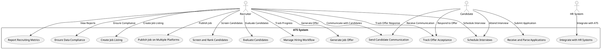
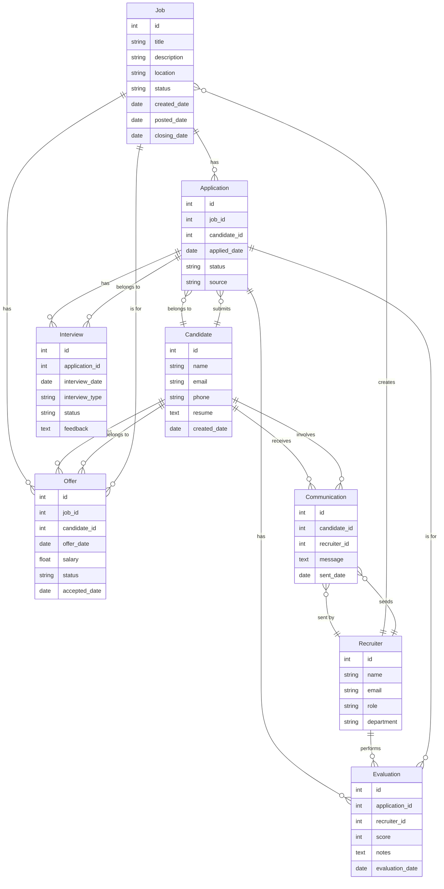

# ChatGPT

# Prompt #1
> You're a product manager expert in ATS (application-tracking-systems). What are the main functionalities you think are important? Please, give me the answer in priority order.

---
As an expert in ATS (Applicant Tracking Systems), the main functionalities that are critical for its success can be prioritized based on both the user experience (for recruiters and hiring teams) and the system’s ability to improve efficiency and effectiveness. Here's a prioritized list of key functionalities:

### 1. **Candidate Sourcing & Job Posting Automation**
   - **Centralized Job Posting:** Ability to post jobs across multiple platforms (e.g., job boards, career pages, social media) from a single dashboard.
   - **Resume Parsing:** Automatically extracts key information (experience, education, skills) from resumes and structures it for quick review.
   - **Candidate Database Integration:** A searchable database that allows recruiters to store and search through resumes/CVs for current or future roles.

### 2. **Customizable Workflow Management**
   - **Pipeline Customization:** Flexibility to customize hiring stages (e.g., screening, interview rounds, offer) to align with different hiring processes.
   - **Task Automation:** Automated email triggers for communication with candidates (e.g., interview invitations, rejection letters, reminders).
   - **Interview Scheduling:** Integrated scheduling tools that sync with calendars (Google, Outlook) to streamline the interview process.

### 3. **Candidate Evaluation Tools**
   - **Collaborative Rating & Feedback:** A system for interviewers to provide structured feedback and ratings on candidates that is shared within the hiring team.
   - **Customizable Scorecards:** Create scorecards tailored to the role for standardized candidate evaluation.
   - **Assessment & Testing Integration:** Integration with third-party tools to conduct skills assessments, personality tests, or technical tests within the platform.

### 4. **Analytics & Reporting**
   - **Time-to-Hire Metrics:** Track key recruiting KPIs, such as time-to-fill, cost-per-hire, source effectiveness, etc.
   - **Diversity & Inclusion Reporting:** Tools to monitor and improve diversity hiring efforts and compliance with equal opportunity regulations.
   - **Custom Reports:** Ability to generate reports on-demand, specific to different metrics or hiring stages.

### 5. **Candidate Communication & Engagement**
   - **Automated Messaging:** Pre-built templates for personalized email communication that can be sent in bulk (e.g., application receipt, interview follow-up).
   - **Candidate Portal:** A self-service portal where candidates can track the status of their applications and manage documents.
   - **Mobile Optimization:** Both candidate-facing interfaces and recruiter tools should be mobile-friendly, ensuring accessibility on-the-go.

### 6. **Integration with HR Tech Ecosystem**
   - **HRIS/HRMS Integration:** Seamless data transfer to HR systems for onboarding and employee record management.
   - **CRM for Passive Candidates:** A candidate relationship management system that allows for nurturing passive candidates over time for future openings.
   - **API Access:** Open API to allow custom integrations with third-party tools (e.g., payroll systems, Slack, or background check services).

### 7. **Compliance & Data Security**
   - **GDPR/EEOC Compliance Tools:** Ensure compliance with data protection regulations and equal employment opportunity laws. Automate candidate consent management and anonymization of data as needed.
   - **Audit Trail:** Track all recruiter actions to ensure transparency and accountability.
   - **Secure Data Storage:** Ensuring that candidate and company data are stored securely, with necessary encryption and access controls.

### 8. **AI-Powered Tools**
   - **Candidate Matching:** AI algorithms to match candidates to job descriptions based on skills, experience, and qualifications.
   - **Sentiment Analysis:** AI-powered tools to analyze candidate communication (e.g., cover letters, emails) and assess soft skills.
   - **Predictive Analytics:** Forecast hiring trends, candidate success rate, and help predict turnover based on historical data.

### 9. **Mobile-Friendly & User-Centric Interface**
   - **Intuitive UI/UX:** A user-friendly interface that minimizes the learning curve for recruiters and hiring managers.
   - **Mobile Applications:** Mobile apps or responsive designs for on-the-go hiring activities (e.g., reviewing resumes, coordinating interviews).

### 10. **Collaboration & Workflow Transparency**
   - **Team Collaboration Features:** Built-in tools for collaborative hiring decisions, such as @mentions, shared notes, and discussion threads.
   - **Cross-Department Transparency:** Ability to invite and share candidate profiles with other departments or senior leaders without compromising privacy.

### 11. **Scalability & Flexibility**
   - **Role-Based Access Control:** Provide different levels of access to recruiters, hiring managers, and other stakeholders.
   - **Scalable Infrastructure:** ATS should support growing organizations and the ability to handle high volumes of applications.

These functionalities represent a holistic and efficient ATS system that supports not only the recruiting process but also candidate engagement, team collaboration, and strategic decision-making. Prioritizing candidate sourcing, workflow automation, and integrations will have the most immediate impact on recruitment efficiency, followed by advanced reporting and AI-driven tools.

# Prompt #2
>What benefits are there using an ATS to consider its use?
---
Using an Applicant Tracking System (ATS) brings several key benefits to organizations, particularly those with high hiring volumes or complex recruiting needs. Here's an overview of the most significant advantages:

### 1. **Efficiency and Time Savings**
   - **Automated Resume Screening:** ATS automatically scans, parses, and ranks candidates based on job requirements, reducing the time spent manually reviewing resumes.
   - **Centralized Data Management:** All applications, candidate profiles, and communication are stored in a single platform, making it easy for recruiters and hiring managers to access and manage candidate data.
   - **Workflow Automation:** Automating tasks like email communication, interview scheduling, and job posting allows recruiters to focus on more strategic activities like engaging candidates or interviewing.
   - **Bulk Actions:** Recruiters can perform tasks in bulk, such as sending out rejection emails or moving multiple candidates to the next hiring stage simultaneously.

### 2. **Improved Candidate Sourcing**
   - **Multi-Channel Job Posting:** With an ATS, recruiters can post job listings across multiple job boards, social media, and career sites in one go, significantly widening the pool of potential candidates.
   - **Access to Passive Talent:** ATS systems with CRM capabilities allow recruiters to maintain a database of passive candidates, making it easier to re-engage them when suitable roles arise.
   - **Enhanced Searchability:** ATS databases allow recruiters to search by keywords, skills, or experience to identify candidates quickly, even from past applications.

### 3. **Better Collaboration and Communication**
   - **Improved Team Collaboration:** ATS systems offer collaborative features like shared candidate notes, interview feedback forms, and @mentions. This helps ensure all stakeholders stay informed and can easily provide input on candidates.
   - **Streamlined Candidate Communication:** Built-in tools help ensure consistent communication with candidates through pre-set templates, automated responses, and interview invitations. Candidates stay informed about their application status, improving their experience.

### 4. **Enhanced Candidate Experience**
   - **Faster Response Times:** Automating communication and status updates means candidates are notified promptly, which improves their perception of the company.
   - **Clear Application Tracking:** Candidate portals give applicants visibility into the status of their applications, which helps manage their expectations and reduces frustration.
   - **Mobile Optimization:** Mobile-friendly ATS platforms allow candidates to apply on-the-go, creating a more accessible and seamless experience.

### 5. **Improved Quality of Hire**
   - **Data-Driven Decision Making:** ATS platforms collect and analyze recruiting data, allowing organizations to track key metrics like time-to-hire, cost-per-hire, and candidate source effectiveness. This data enables better hiring strategies and optimizes resource allocation.
   - **Standardized Screening Process:** By using scorecards, assessments, and evaluation forms, ATS ensures that all candidates are measured against the same criteria, helping eliminate bias and improving the quality of hires.
   - **AI-Powered Matching:** Many ATS systems offer AI-driven candidate matching, helping recruiters quickly identify candidates that are the best fit based on experience, skills, and cultural alignment.

### 6. **Compliance and Risk Management**
   - **EEO and GDPR Compliance:** ATS systems help ensure compliance with regulations such as Equal Employment Opportunity (EEO) and General Data Protection Regulation (GDPR). They track necessary data and candidate consent, ensuring the company adheres to legal requirements.
   - **Automated Record Keeping:** An ATS maintains detailed records of each stage of the hiring process, ensuring that there is a clear audit trail in case of legal challenges or audits.

### 7. **Improved Candidate Nurturing**
   - **Talent Pool Building:** An ATS allows organizations to build and maintain a database of candidates, including those who may not have been hired but could be a fit for future roles. This reduces time spent sourcing new candidates for each opening.
   - **Candidate Relationship Management (CRM):** Features that nurture relationships with passive candidates over time ensure organizations can keep in touch and engage top talent when new opportunities arise.

### 8. **Scalability for Growing Companies**
   - **Handles High Volumes of Applications:** ATS systems are designed to handle large amounts of candidate data, making them scalable for organizations experiencing growth or seasonal hiring peaks.
   - **Adaptable Workflows:** As companies evolve, ATS workflows can be customized to meet new organizational structures, job roles, or hiring processes.

### 9. **Reduced Hiring Costs**
   - **Lower Time-to-Fill:** By automating tasks and improving sourcing efficiency, ATS helps reduce the time needed to fill open positions, lowering the associated costs.
   - **Optimized Job Ad Spending:** ATS analytics track the performance of various sourcing channels, enabling organizations to focus their budget on platforms that deliver the best candidate quality.

### 10. **Enhanced Analytics and Reporting**
   - **Recruiting Metrics & Insights:** ATS platforms provide real-time reporting on recruiting performance (e.g., time-to-hire, cost-per-hire, and applicant drop-off rates), helping HR teams continuously improve their hiring processes.
   - **Predictive Analytics:** Some ATS systems offer predictive analytics to anticipate trends in hiring, such as turnover rates or the likelihood of a candidate's success in the role, contributing to more strategic hiring decisions.

### 11. **Bias Reduction**
   - **Standardized Screening Tools:** ATS systems use predefined criteria, structured evaluations, and blind hiring options (where identifying details are hidden from the hiring team) to reduce bias and promote fairer decision-making.
   - **AI-Driven Solutions:** AI tools can help identify top candidates based on objective data points, reducing human bias in early-stage screening.

### 12. **Customization and Flexibility**
   - **Customizable Workflows:** Different organizations have different hiring processes, and an ATS offers customizable workflows to adapt to various hiring needs, ensuring smoother operations.
   - **Tailored Candidate Pipelines:** Companies can create tailored pipelines for different roles, departments, or locations to manage applicants more efficiently.

In summary, the benefits of an ATS extend across efficiency, candidate experience, compliance, data-driven decision-making, and cost-effectiveness. It becomes an essential tool, especially for organizations looking to scale, improve the quality of hires, and manage their recruitment operations more strategically.

# Prompt #3
> What are the most well-known ATS open source? And the commercial? Compare them based on the principal functionalities: Candidate Sourcing & Job Posting Automation, Candidate Evaluation Tools, Candidate Communication & Engagement and Integration with HR Tech Ecosystem
---
When comparing **open-source** and **commercial ATS** (Applicant Tracking Systems), there are distinct differences in terms of features, scalability, customization, and integration capabilities. Below is a comparison of some of the most well-known ATS, divided into open-source and commercial solutions, based on key functionalities:

---

### **Open-Source ATS:**
Open-source ATS systems are often preferred by companies with specific customization needs or limited budgets. Here are some of the most well-known options:

#### 1. **OpenCATS**
   - **Candidate Sourcing & Job Posting Automation:**
     - Basic functionality with limited integrations for job posting. Primarily designed to upload candidates from various sources manually. Integrations with job boards are not as robust as commercial ATS solutions.
   - **Candidate Evaluation Tools:**
     - Basic candidate evaluation through notes and manual scorecards. No advanced assessment tools or AI-powered evaluations.
   - **Candidate Communication & Engagement:**
     - Email templates and bulk communication are supported but not highly customizable. Lacks engagement features like candidate portals or automated nurture campaigns.
   - **Integration with HR Tech Ecosystem:**
     - Limited integration options. Most integrations are custom-built or require plugins, making it more challenging to connect with broader HR systems.
   - **Key Feature:** Completely free, with customizable workflows but limited out-of-the-box features.

#### 2. **Odoo Recruitment (part of the Odoo ERP)**
   - **Candidate Sourcing & Job Posting Automation:**
     - Provides integration with job boards and social media, allowing for some degree of automation in posting jobs and receiving applications.
   - **Candidate Evaluation Tools:**
     - Offers a built-in evaluation system, including the ability to create scorecards and track candidate progress through different stages.
   - **Candidate Communication & Engagement:**
     - Provides email templates and automated communication workflows. However, lacks sophisticated engagement tools like candidate portals or mobile optimization.
   - **Integration with HR Tech Ecosystem:**
     - As part of the Odoo ERP, it integrates well with other Odoo applications (HR, finance, etc.), but third-party HR tools require custom development or plugins.
   - **Key Feature:** Excellent ERP integration capabilities, especially useful for companies already using Odoo, but more complex to set up and manage.

#### 3. **Jobberbase**
   - **Candidate Sourcing & Job Posting Automation:**
     - Offers a simple, single-platform job posting solution. Primarily focused on job listing features, with limited sourcing tools.
   - **Candidate Evaluation Tools:**
     - Minimal evaluation tools are provided. No structured candidate assessment or interview feedback functionality.
   - **Candidate Communication & Engagement:**
     - Supports basic email communication with candidates but lacks advanced communication automation.
   - **Integration with HR Tech Ecosystem:**
     - Integration with other HR systems is limited. Custom development is often required to connect Jobberbase with external HR tools.
   - **Key Feature:** Lightweight and easy-to-deploy solution for companies needing basic ATS functionalities.

---

### **Commercial ATS:**
Commercial ATS are typically more feature-rich and offer better integration, support, and scalability. Below are some of the leading options:

#### 1. **Workday Recruiting**
   - **Candidate Sourcing & Job Posting Automation:**
     - Comprehensive sourcing tools, including multi-platform job posting across job boards, social media, and career websites. AI-driven sourcing and candidate matching.
   - **Candidate Evaluation Tools:**
     - Advanced candidate evaluation capabilities, including customizable scorecards, structured feedback, and AI-powered assessments to help prioritize candidates.
   - **Candidate Communication & Engagement:**
     - Excellent communication tools, including automated messaging, personalized engagement, and candidate portals for tracking applications. Mobile-friendly for both recruiters and candidates.
   - **Integration with HR Tech Ecosystem:**
     - Seamlessly integrates with the broader Workday suite (HRIS, payroll, finance, etc.), making it an ideal choice for companies already using Workday’s ecosystem.
   - **Key Feature:** Best for organizations looking for comprehensive HR and recruiting solutions with strong enterprise-grade integrations.

#### 2. **Greenhouse**
   - **Candidate Sourcing & Job Posting Automation:**
     - Strong job posting automation with integration into major job boards, career sites, and social media. Offers referral programs and robust sourcing tools.
   - **Candidate Evaluation Tools:**
     - Extensive evaluation tools, including customizable scorecards, structured interview kits, and feedback forms. Also supports video interviews and assessment integrations.
   - **Candidate Communication & Engagement:**
     - Provides advanced communication features with automated email templates, personalized messaging, and a candidate portal. It also offers tools for long-term candidate engagement (CRM).
   - **Integration with HR Tech Ecosystem:**
     - Excellent integration with HRIS systems, payroll, onboarding tools, and other HR tech platforms through APIs. Supports integrations with tools like Slack, Zoom, and various assessment platforms.
   - **Key Feature:** Highly customizable and widely regarded for its candidate evaluation tools and easy integration with other systems.

#### 3. **Lever**
   - **Candidate Sourcing & Job Posting Automation:**
     - Strong sourcing and multi-channel job posting capabilities, including integrations with popular job boards, social media, and internal referral programs.
   - **Candidate Evaluation Tools:**
     - Offers collaborative feedback features, interview scorecards, and customizable evaluation workflows. Integrated with third-party assessment and testing platforms.
   - **Candidate Communication & Engagement:**
     - Provides automated candidate communication, personalized email sequences, and a built-in CRM for nurturing passive candidates. Mobile optimization enhances candidate engagement.
   - **Integration with HR Tech Ecosystem:**
     - Integrates well with many HR systems, including onboarding, payroll, and HRIS tools. Lever also offers API access for custom integrations.
   - **Key Feature:** Best known for its CRM capabilities and easy-to-use interface, making it ideal for companies focused on passive candidate engagement.

#### 4. **BambooHR**
   - **Candidate Sourcing & Job Posting Automation:**
     - Offers easy job posting to multiple job boards, and integrates with social media channels for sourcing. However, the sourcing tools are more basic compared to other commercial options.
   - **Candidate Evaluation Tools:**
     - Provides standard evaluation tools, including interview scorecards and feedback mechanisms. Less customizable than Workday or Greenhouse but sufficient for most SMBs.
   - **Candidate Communication & Engagement:**
     - Email automation is built-in, with easy-to-use templates for communication. Lacks a candidate portal but offers solid engagement through email and SMS.
   - **Integration with HR Tech Ecosystem:**
     - Integrates well with other BambooHR modules (onboarding, payroll, time tracking). Third-party integration options are available but not as extensive as some competitors.
   - **Key Feature:** Great for small to medium-sized businesses looking for a simple and affordable ATS that integrates with HR functions.

---

### **Comparison of Key Functionalities:**

| **Functionality**                 | **OpenCATS**        | **Odoo Recruitment** | **Workday Recruiting**   | **Greenhouse**          | **Lever**              | **BambooHR**           |
|-----------------------------------|---------------------|----------------------|--------------------------|-------------------------|------------------------|------------------------|
| **Candidate Sourcing & Job Posting Automation** | Basic, no automation | Moderate, integrated with Odoo ERP | Advanced, multi-platform, AI sourcing | Strong, multi-channel job postings | Robust, multi-channel, CRM | Simple, multi-board integration |
| **Candidate Evaluation Tools**    | Basic scorecards    | Customizable scorecards | Advanced, AI-driven, structured feedback | Extensive, customizable | Collaborative feedback, assessment integrations | Standard scorecards, feedback |
| **Candidate Communication & Engagement** | Basic email templates | Basic automation     | Advanced, personalized, candidate portal | Advanced, personalized, mobile-friendly | Automated, personalized CRM | Basic email automation |
| **Integration with HR Tech Ecosystem** | Limited            | Integrates well with Odoo ERP | Seamless with Workday ecosystem | Excellent, API and third-party tools | Strong, API access, third-party | Basic HRIS integration        |

---

### **Conclusion:**

- **Open-source ATS** like OpenCATS, Odoo Recruitment, and Jobberbase are best suited for organizations that need basic functionality and are willing to invest in customization. They are cost-effective but limited in automation and integration.
- **Commercial ATS** like **Workday Recruiting**, **Greenhouse**, **Lever**, and **BambooHR** offer more robust, out-of-the-box features with superior automation, integration, and candidate engagement. Workday is ideal for large enterprises needing deep HRIS integration, while Greenhouse and Lever excel in candidate engagement and evaluation tools. BambooHR is more suitable for small to medium-sized businesses looking for an easy-to-use and affordable solution.

# Prompt #4
> Going back to the first question, now, as an expert software analyst, I'm building an ATS system. List and briefly describe the most important use cases to implement for achieving basic functionality.
---
When building an ATS (Applicant Tracking System) from scratch, it’s essential to cover the basic functionalities that support the core recruiting process. Below is a list of the most important **use cases** to implement for achieving a functional ATS system, divided by major areas:

### 1. **Job Posting and Candidate Sourcing**
   - **Create and Publish Job Listings:**
     - The system allows recruiters to create detailed job postings with fields for job title, description, qualifications, etc. It also enables them to publish these listings on multiple job boards, career websites, and social media platforms.
   - **Track Job Posting Performance:**
     - The system tracks the effectiveness of each job posting across different channels, providing metrics such as views, applications, and candidate sources.
   - **Post to Multiple Channels:**
     - Integrate with third-party job boards (Indeed, LinkedIn, etc.) and social media platforms to automate the distribution of job listings.

### 2. **Candidate Application and Resume Management**
   - **Receive and Parse Applications:**
     - The system accepts job applications (via job boards, career pages, or direct upload) and parses resumes to extract relevant information (e.g., skills, experience, education) into structured data for easy review.
   - **Search and Filter Candidates:**
     - Implement search functionality that allows recruiters to search and filter candidates based on keywords, qualifications, skills, or experience. This includes Boolean search, tag-based filtering, and saved search queries.
   - **Save Applicant Profile:**
     - Allow recruiters to store candidate profiles in the system, which can include resumes, cover letters, and other related documentation.

### 3. **Candidate Screening and Evaluation**
   - **Initial Candidate Screening:**
     - Automatically screen candidates based on predefined criteria (e.g., skills, experience, location) and rank or flag candidates that meet the job’s minimum qualifications.
   - **Collaborative Candidate Review:**
     - Provide functionality for hiring managers and interviewers to collaboratively review candidates by sharing feedback, comments, and notes on the candidate’s profile.
   - **Customizable Scorecards:**
     - Enable recruiters and hiring teams to create scorecards for evaluating candidates based on criteria such as qualifications, experience, technical skills, and cultural fit.

### 4. **Interview Scheduling and Management**
   - **Automated Interview Scheduling:**
     - Integrate with calendar systems (e.g., Google Calendar, Outlook) to automate interview scheduling, allowing candidates to choose available time slots, and syncing events with recruiter and interviewers' calendars.
   - **Track Interview Stages:**
     - Track candidate progress through multiple interview stages, from initial phone screening to final interview rounds, with clear visual indicators of the current stage.
   - **Send Interview Invitations:**
     - Automatically send interview invitations and follow-up emails to candidates, with the option to include details such as the interview location, video conference link, or preparation materials.

### 5. **Candidate Communication and Engagement**
   - **Automated Email Communication:**
     - Allow the system to automatically send acknowledgment emails when a candidate applies, rejection notifications, or next-step instructions. Provide email templates that can be customized.
   - **Candidate Portal Access:**
     - Implement a self-service portal for candidates where they can track the status of their application, upload additional documents, and communicate directly with recruiters.
   - **Bulk Messaging:**
     - Enable recruiters to send mass communication to a group of candidates (e.g., follow-up emails, interview invites, or rejection notices) without manual repetition.

### 6. **Candidate Status Tracking and Workflow Management**
   - **Track Application Status:**
     - Implement a feature to update and track the candidate’s application status (e.g., “Applied,” “In Review,” “Interview Scheduled,” “Rejected,” “Offer Extended”). These statuses can be updated manually or automatically based on candidate progress.
   - **Customizable Hiring Workflow:**
     - Allow recruiters to define custom hiring workflows for different job roles, including stages such as pre-screening, phone interviews, technical tests, and final interviews.
   - **Move Candidates Between Stages:**
     - Enable recruiters to easily move candidates through the hiring pipeline and change their status as they progress through various interview rounds.

### 7. **Offer Management**
   - **Generate Job Offers:**
     - Implement a feature for recruiters to generate customized job offers, which can include salary, benefits, and start date. The system should also allow document templates for standard offer letters.
   - **Track Offer Acceptance/Decline:**
     - Track whether candidates accept or decline job offers, and update their status in the system accordingly.

### 8. **Reporting and Analytics**
   - **Basic Recruiting Metrics:**
     - Provide reports on key metrics such as time-to-fill, source-of-hire effectiveness, number of applications per role, and the status of candidates in the hiring pipeline.
   - **Diversity and Compliance Reporting:**
     - Include basic reporting on diversity hiring metrics (e.g., gender, ethnicity) to ensure compliance with regulations such as EEO or GDPR.
   - **Job Posting Performance Reports:**
     - Track the performance of job postings across various platforms, helping recruiters determine which channels are yielding the best candidates.

### 9. **Data Security and Compliance**
   - **Candidate Data Protection:**
     - Ensure that candidate data is stored securely, with appropriate access controls, encryption, and compliance with data protection regulations such as GDPR.
   - **Consent Management:**
     - Collect and manage candidate consent for storing personal data, allowing candidates to request data deletion or removal from the system.

### 10. **Integration with External Systems**
   - **Integration with HRIS/HR Tech Ecosystem:**
     - Implement integrations with Human Resource Information Systems (HRIS), payroll systems, or onboarding platforms to transfer data of hired candidates.
   - **Assessment and Testing Integration:**
     - Allow the ATS to integrate with third-party assessment tools to administer technical tests, personality tests, or coding challenges and record candidate results.
   - **API for Custom Integrations:**
     - Develop an open API to allow third-party tools and services to integrate with the ATS for custom workflows, data exchange, or additional features.

---

### Summary of the Most Important Use Cases:

1. **Job Creation and Publishing**
2. **Application Management and Resume Parsing**
3. **Candidate Screening and Ranking**
4. **Interview Scheduling**
5. **Candidate Communication**
6. **Hiring Workflow and Candidate Progress Tracking**
7. **Offer Creation and Tracking**
8. **Basic Reporting and Analytics**
9. **Compliance and Security**
10. **Third-Party System Integration**

By implementing these key use cases, you will cover the fundamental ATS functionalities, ensuring that recruiters can manage applications, evaluate candidates, schedule interviews, and make hiring decisions efficiently.

# Prompt #5
> Could yo give me the use cases in a UML diagram using PlantUML?

---
Here’s a simple **UML Use Case Diagram** using PlantUML syntax for the key functionalities of an ATS (Applicant Tracking System). This diagram represents the interactions between actors (Recruiters, Candidates, and the System) and the use cases.



### Diagram Explanation:
- **Actors**:
  - **Recruiter**: Represents the HR professional or hiring manager using the ATS.
  - **Candidate**: The job applicant interacting with the system (e.g., submitting applications or responding to offers).
  - **HR System**: External HR system that integrates with the ATS for onboarding or other HR functions.

- **Use Cases**:
  1. **Create Job Listing**: Recruiters create job posts.
  2. **Publish Job on Multiple Platforms**: Job posts are automatically shared across job boards.
  3. **Receive and Parse Applications**: Candidates submit their applications, and resumes are parsed.
  4. **Screen and Rank Candidates**: The system automatically screens and ranks applicants.
  5. **Schedule Interviews**: Recruiters schedule interviews with candidates.
  6. **Evaluate Candidates**: Recruiters collaborate on candidate evaluations.
  7. **Send Candidate Communication**: Automated messages (emails, notifications) to candidates.
  8. **Manage Hiring Workflow**: Tracks candidate progress across the recruitment stages.
  9. **Generate Job Offer**: Recruiters generate and send offers.
  10. **Track Offer Acceptance**: Monitors candidate responses to job offers.
  11. **Report Recruiting Metrics**: Provides recruitment performance reports.
  12. **Integrate with HR Systems**: Data synchronization with external HR systems.
  13. **Ensure Data Compliance**: GDPR or other data protection law compliance.

You can copy this PlantUML code and render it in a tool that supports PlantUML diagrams to visualize the interactions.

Note from the author: See the image diagram_use_cases.png

# Prompt #6
>Now, using the previous information with use cases and functionalities, you're a brilliant software architect. You can design, explain and diagramming the different aspects of a software system.
>
>I'm building an ATS system, we need to define the most important entities with the necessary fields for each one.
>
>Don't forget to add the relationship between entities and generate the code to use in mermaid tool. 

----
Let's design the **entity-relationship model (ERD)** for an ATS system. We'll define the most important entities, their fields, and the relationships between them.

### Key Entities in the ATS System:
1. **Job** – Represents a job listing.
2. **Candidate** – Represents an applicant.
3. **Application** – Represents an application submitted by a candidate for a job.
4. **Interview** – Represents interviews scheduled for candidates.
5. **Evaluation** – Represents the evaluation of a candidate.
6. **Offer** – Represents a job offer extended to a candidate.
7. **Recruiter** – Represents the user managing the hiring process.
8. **Communication** – Represents communication between recruiter and candidate.

### Fields and Relationships:

1. **Job**
   - Fields: `id`, `title`, `description`, `location`, `status`, `created_date`, `posted_date`, `closing_date`
   - Relationships: 
     - A job is created by a **Recruiter** (many-to-one).
     - A job can have multiple **Applications** (one-to-many).

2. **Candidate**
   - Fields: `id`, `name`, `email`, `phone`, `resume`, `created_date`
   - Relationships:
     - A candidate can submit multiple **Applications** (one-to-many).
     - A candidate may have multiple **Interviews** (one-to-many).
     - A candidate may receive **Offers** (one-to-many).
     - A candidate can have multiple **Communications** (one-to-many).

3. **Application**
   - Fields: `id`, `job_id`, `candidate_id`, `applied_date`, `status`, `source`
   - Relationships:
     - Each application is for a **Job** (many-to-one).
     - Each application is submitted by a **Candidate** (many-to-one).
     - An application can have multiple **Evaluations** (one-to-many).
     - An application may have **Interviews** (one-to-one).

4. **Interview**
   - Fields: `id`, `application_id`, `interview_date`, `interview_type`, `status`, `feedback`
   - Relationships:
     - An interview is associated with an **Application** (many-to-one).

5. **Evaluation**
   - Fields: `id`, `application_id`, `recruiter_id`, `score`, `notes`, `evaluation_date`
   - Relationships:
     - Each evaluation is given for an **Application** (many-to-one).
     - Each evaluation is performed by a **Recruiter** (many-to-one).

6. **Offer**
   - Fields: `id`, `job_id`, `candidate_id`, `offer_date`, `salary`, `status`, `accepted_date`
   - Relationships:
     - An offer is extended to a **Candidate** (many-to-one).
     - An offer is associated with a **Job** (many-to-one).

7. **Recruiter**
   - Fields: `id`, `name`, `email`, `role`, `department`
   - Relationships:
     - A recruiter can create multiple **Jobs** (one-to-many).
     - A recruiter performs **Evaluations** (one-to-many).
     - A recruiter can be involved in **Communications** (one-to-many).

8. **Communication**
   - Fields: `id`, `candidate_id`, `recruiter_id`, `message`, `sent_date`
   - Relationships:
     - A communication involves a **Candidate** (many-to-one).
     - A communication is sent by a **Recruiter** (many-to-one).

---

### Mermaid Diagram Code



### Explanation of Relationships:
- **Job to Application**: A job listing can receive multiple applications (one-to-many).
- **Candidate to Application**: A candidate can submit multiple applications (one-to-many).
- **Application to Interview**: An application can have multiple interviews (one-to-many).
- **Application to Evaluation**: Multiple evaluations can be made for a single application (one-to-many).
- **Job to Offer**: Each job can have multiple offers extended to candidates (one-to-many).
- **Candidate to Offer**: A candidate may receive multiple offers (one-to-many).
- **Recruiter to Job**: A recruiter can create multiple job listings (one-to-many).
- **Recruiter to Evaluation**: A recruiter can evaluate multiple applications (one-to-many).
- **Recruiter to Communication**: A recruiter can send multiple communications to candidates (one-to-many).
- **Candidate to Communication**: A candidate can receive multiple communications from recruiters (one-to-many).

### Summary of Entities:
- **Job** represents open positions.
- **Candidate** represents the job applicants.
- **Application** tracks the candidate's interest in a specific job.
- **Interview** schedules and manages interview interactions.
- **Evaluation** stores feedback and scoring after an interview.
- **Offer** manages job offers sent to candidates.
- **Recruiter** represents the user managing the recruitment process.
- **Communication** logs email and message exchanges between candidates and recruiters.

This structure covers the essential entities and relationships of an ATS system, allowing for managing the recruiting process from job posting through to hiring.

Note from the author: See the image database-erd.png

# Prompt #7.A DiagramGPT
> You're an amazing software architect. Could you provide (at a high level) system design of an ATS system like Linkedin or GlassDoor with the following requirements:
>- Event-Driven architecture
>- Each MS has its own database
>- Fronted that communicates through GraphQL
>- Cloud provider is Microsoft Azure.
>
> Include techniques to improve the performance like cache and load balancer
---

Note from the author: See the image ddiagram_microservices.png

# Prompt #7.B with ChatGPT
> Hello! You're a brilliant software architect with extensive experience in designing and explaining architectural patterns. I'm building a new ATS (application-tracking-systems) system from scratch.
>
>Could you provide me (at a high level) a system design of an ATS system like Linkedin or GlassDoor with the following requirements:
>- Event-Driven architecture 
>- Each MS has its own database
>- Frontend that communicates through GraphQL 
>- All public endpoints must be protected from unauthorized users' access.
>- The cloud provider is AWS.
>- Include techniques to improve the performance when it's necessary or possible like caches and load balancers. 
>
>The ERD entities for the ATS system that you need to take into account are:
>1. **Job** – Represents a job listing.
>2. **Candidate** – Represents an applicant.
>3. **Application** – Represents an application submitted by a candidate for a job.
>4. **Interview** – Represents interviews scheduled for candidates.
>5. **Evaluation** – Represents the evaluation of a candidate.
>6. **Offer** – Represents a job offer extended to a candidate.
>7. **Recruiter** – Represents the user managing the hiring process.
>8. **Communication** – Represents communication between recruiter and candidate.
>
> Please, give me the information with explanations and the necessary code to generate the code using the Diagram library in Python (https://diagrams.mingrammer.com/)

---

To design an ATS (Application Tracking System) that leverages **Event-Driven Microservices Architecture** with AWS cloud, we'll ensure scalability, flexibility, and performance optimization. Here’s a high-level system design based on your requirements:

---

### **1. Architectural Overview:**

We will break down the system into distinct services, each managing its own **bounded context** (database), ensuring separation of concerns. Each service will publish and consume events via an event broker (like Amazon SNS/SQS or EventBridge) to decouple services. The frontend will use **GraphQL** to communicate with the backend, and all public endpoints will be secured with authentication/authorization (AWS Cognito or OAuth2).

---

### **2. Key Components of the System:**

#### **Frontend (Client)**
- A web or mobile application built with **React/Angular/Vue** using **GraphQL** to fetch and manage data from backend services.
- GraphQL API Gateway: A single GraphQL endpoint for clients to interact with backend services in an optimized way. It acts as a query orchestrator.

#### **Microservices**:
Each of these microservices has its own database, and they communicate through events:
1. **Job Service** – Handles job creation and listings.
2. **Candidate Service** – Manages candidate profiles.
3. **Application Service** – Tracks applications submitted for job postings.
4. **Interview Service** – Manages scheduling and updates related to candidate interviews.
5. **Evaluation Service** – Collects and stores evaluation data for candidates.
6. **Offer Service** – Manages job offers.
7. **Recruiter Service** – Manages recruiter profiles and access.
8. **Communication Service** – Stores and manages communication between recruiters and candidates.

#### **Event-Driven Communication:**
- **Amazon SNS/SQS** or **EventBridge** will be used for event-driven communication between services.
  - Example: When a candidate submits an application, the Application Service sends an event that triggers downstream services (e.g., Interview and Evaluation services).

#### **Authentication & Authorization:**
- **AWS Cognito** or OAuth2 with JWT Tokens to secure the API Gateway and microservices. All public-facing APIs will check the JWT tokens for authentication and authorization.

#### **Data Storage:**
- Each microservice will use its own database (AWS RDS for relational data, DynamoDB for document-oriented data).
  - Example: Job, Candidate, and Application data can be stored in **RDS (PostgreSQL)**, while **DynamoDB** can be used for more flexible and scalable data structures such as Communication logs.

#### **Caching:**
- **Amazon ElastiCache (Redis)** can be used to cache frequently accessed data (e.g., job listings, candidate details) to reduce load on the database.

#### **Load Balancers:**
- **Application Load Balancer (ALB)**: Handles traffic and routes it to the correct microservices.
- **Auto Scaling**: To ensure microservices scale in response to traffic patterns.

---

### **3. High-Level AWS Architecture Design**

- **Client (Browser/Mobile App)**: Communicates with **GraphQL Gateway** via HTTP(S).
- **GraphQL API Gateway**: Provides a unified API for the client to query multiple microservices.
- **Amazon Cognito**: For authentication/authorization, handling user sessions and tokens.
- **SNS/SQS or EventBridge**: Manages the event-driven architecture, decoupling services.
- **ElastiCache (Redis)**: Used for caching frequently accessed data to improve performance.
- **Microservices**: Deployed in ECS (Elastic Container Service) or EKS (Elastic Kubernetes Service) for containerization.
- **RDS/DynamoDB**: Each microservice has its own database to maintain independence and scalability.

---

### **4. Event-Driven Flow Example (Application Submission):**

1. A **candidate** submits an **application** via the frontend.
2. The **GraphQL API Gateway** sends the mutation to the **Application Service**.
3. The **Application Service** writes the application data to its own database and publishes an event (e.g., `ApplicationSubmitted`).
4. The **Interview Service**, **Evaluation Service**, and **Offer Service** consume this event:
   - **Interview Service** may schedule an interview.
   - **Evaluation Service** triggers a candidate review process.
   - **Offer Service** waits for evaluations before proceeding to the offer phase.
   
By decoupling these services, each can operate independently, improving system resilience and scalability.

---

### **5. Python Code to Generate AWS Diagram with Diagrams Library:**

```python
from diagrams import Diagram, Cluster, Edge
from diagrams.aws.compute import ECS
from diagrams.aws.database import RDS, Dynamodb, ElastiCache
from diagrams.aws.network import APIGateway, ALB, Route53
from diagrams.aws.security import Cognito
from diagrams.aws.integration import SQS, SNS, Eventbridge
from diagrams.aws.management import Cloudwatch
from diagrams.onprem.client import Client

with Diagram("ATS System Architecture", show=False):

    client = Client("Frontend Client")

    with Cluster("Frontend"):
        graphql_gateway = APIGateway("GraphQL API Gateway")

    with Cluster("Authentication"):
        cognito = Cognito("AWS Cognito")

    client >> Edge(label="GraphQL Queries/Mutations") >> graphql_gateway
    graphql_gateway >> Edge(label="JWT Authentication") >> cognito

    with Cluster("Microservices"):
        with Cluster("Job Service"):
            job_service = ECS("Job Service")
            job_db = RDS("Job DB")
            job_service >> job_db

        with Cluster("Candidate Service"):
            candidate_service = ECS("Candidate Service")
            candidate_db = RDS("Candidate DB")
            candidate_service >> candidate_db

        with Cluster("Application Service"):
            application_service = ECS("Application Service")
            application_db = RDS("Application DB")
            application_service >> application_db

        with Cluster("Interview Service"):
            interview_service = ECS("Interview Service")
            interview_db = RDS("Interview DB")
            interview_service >> interview_db

        with Cluster("Evaluation Service"):
            evaluation_service = ECS("Evaluation Service")
            evaluation_db = RDS("Evaluation DB")
            evaluation_service >> evaluation_db

        with Cluster("Offer Service"):
            offer_service = ECS("Offer Service")
            offer_db = RDS("Offer DB")
            offer_service >> offer_db

        with Cluster("Recruiter Service"):
            recruiter_service = ECS("Recruiter Service")
            recruiter_db = RDS("Recruiter DB")
            recruiter_service >> recruiter_db

        with Cluster("Communication Service"):
            communication_service = ECS("Communication Service")
            communication_db = Dynamodb("Communication DB")
            communication_service >> communication_db

    event_bus = Eventbridge("Event Bus")
    
    job_service >> event_bus
    application_service >> event_bus
    interview_service >> event_bus
    evaluation_service >> event_bus
    offer_service >> event_bus
    recruiter_service >> event_bus
    communication_service >> event_bus

    # Cache Layer
    cache = ElastiCache("Redis Cache")
    graphql_gateway >> cache
    
    # Load Balancer
    alb = ALB("Load Balancer")
    alb >> graphql_gateway

    # Monitoring
    cloudwatch = Cloudwatch("Cloudwatch Monitoring")
    cloudwatch >> application_service
    cloudwatch >> event_bus
```

---

### **6. Explanation of Key Components:**

- **Client and API Gateway**: The client (web/mobile app) interacts with the system using GraphQL API Gateway, ensuring efficient data fetching and updating.
- **Authentication (AWS Cognito)**: Manages user identities and tokens, ensuring that only authorized users can access protected endpoints.
- **Microservices**: Each service handles a specific business domain (e.g., Job, Application, Interview). They communicate through an event-driven architecture, using SNS/SQS or EventBridge.
- **Event Bus (EventBridge)**: Decouples services, allowing them to asynchronously handle events like `ApplicationSubmitted`.
- **Caching**: ElastiCache is used to improve performance by storing frequently accessed data (e.g., job listings, candidates).
- **Load Balancer (ALB)**: Distributes incoming traffic to the microservices.
- **Databases**: Each microservice manages its own database (RDS for structured data, DynamoDB for unstructured data).

---

### **7. Performance Optimization Techniques:**

- **Caching**: Utilize Redis via ElastiCache for frequently accessed data like job listings and candidate details to reduce database load.
- **Load Balancer & Auto-Scaling**: Use ALB with ECS/EKS auto-scaling groups to handle dynamic traffic loads.
- **Event-Driven Architecture**: Microservices are decoupled using events, which enhances performance and resilience.

This design ensures that your ATS system is scalable, secure, and easy to maintain while providing flexibility for future enhancements.

# Prompt #7.B.2
> In the code of the diagram, the microservices didn't give any connection with the gateway, and the load balancer is not in the correct way because should be put in the middle of the gateway.
---
You're absolutely right! The **GraphQL Gateway** should be connected to each of the microservices, and the **Load Balancer (ALB)** should be placed in between the frontend and the GraphQL Gateway, not after it. I'll correct the architecture diagram and update the connections.

Here's the revised Python code for the diagram, where:
1. The **Load Balancer** is placed in front of the **GraphQL Gateway**.
2. The **GraphQL Gateway** connects directly to each microservice.
3. The microservices continue to have their own databases and communicate with the event bus for inter-service communication.

### Updated Python Code for the Diagram:

```python
from diagrams import Diagram, Cluster, Edge
from diagrams.aws.compute import ECS
from diagrams.aws.database import RDS, Dynamodb, ElastiCache
from diagrams.aws.network import APIGateway, ALB, Route53
from diagrams.aws.security import Cognito
from diagrams.aws.integration import SQS, SNS, Eventbridge
from diagrams.aws.management import Cloudwatch
from diagrams.onprem.client import Client

with Diagram("ATS System Architecture", show=False):

    client = Client("Frontend Client")

    with Cluster("Frontend"):
        # Load Balancer placed in front of the GraphQL Gateway
        alb = ALB("Load Balancer")
        graphql_gateway = APIGateway("GraphQL API Gateway")
        client >> Edge(label="HTTP/S Requests") >> alb >> graphql_gateway

    with Cluster("Authentication"):
        cognito = Cognito("AWS Cognito")

    # Authentication for the GraphQL Gateway
    graphql_gateway >> Edge(label="JWT Authentication") >> cognito

    with Cluster("Microservices"):
        with Cluster("Job Service"):
            job_service = ECS("Job Service")
            job_db = RDS("Job DB")
            job_service >> job_db

        with Cluster("Candidate Service"):
            candidate_service = ECS("Candidate Service")
            candidate_db = RDS("Candidate DB")
            candidate_service >> candidate_db

        with Cluster("Application Service"):
            application_service = ECS("Application Service")
            application_db = RDS("Application DB")
            application_service >> application_db

        with Cluster("Interview Service"):
            interview_service = ECS("Interview Service")
            interview_db = RDS("Interview DB")
            interview_service >> interview_db

        with Cluster("Evaluation Service"):
            evaluation_service = ECS("Evaluation Service")
            evaluation_db = RDS("Evaluation DB")
            evaluation_service >> evaluation_db

        with Cluster("Offer Service"):
            offer_service = ECS("Offer Service")
            offer_db = RDS("Offer DB")
            offer_service >> offer_db

        with Cluster("Recruiter Service"):
            recruiter_service = ECS("Recruiter Service")
            recruiter_db = RDS("Recruiter DB")
            recruiter_service >> recruiter_db

        with Cluster("Communication Service"):
            communication_service = ECS("Communication Service")
            communication_db = Dynamodb("Communication DB")
            communication_service >> communication_db

    event_bus = Eventbridge("Event Bus")
    
    # Microservices communicating via the Event Bus
    job_service >> event_bus
    application_service >> event_bus
    interview_service >> event_bus
    evaluation_service >> event_bus
    offer_service >> event_bus
    recruiter_service >> event_bus
    communication_service >> event_bus

    # GraphQL Gateway connecting to each microservice directly
    graphql_gateway >> job_service
    graphql_gateway >> candidate_service
    graphql_gateway >> application_service
    graphql_gateway >> interview_service
    graphql_gateway >> evaluation_service
    graphql_gateway >> offer_service
    graphql_gateway >> recruiter_service
    graphql_gateway >> communication_service

    # Cache Layer connected to the GraphQL Gateway for performance optimization
    cache = ElastiCache("Redis Cache")
    graphql_gateway >> cache
    
    # Monitoring all key services using CloudWatch
    cloudwatch = Cloudwatch("Cloudwatch Monitoring")
    cloudwatch >> application_service
    cloudwatch >> event_bus
```

### Key Updates:

1. **Load Balancer (ALB)**: Now properly placed between the **Frontend** and the **GraphQL Gateway**, ensuring that the incoming traffic is distributed across multiple instances of the **GraphQL Gateway**.
2. **GraphQL Gateway**: It directly communicates with each **microservice** (Job, Candidate, Application, Interview, Evaluation, Offer, Recruiter, and Communication services).
3. **Authentication**: The GraphQL Gateway validates user requests by interacting with **AWS Cognito**.
4. **Event Bus (EventBridge)**: Continues to manage event-driven communication between the microservices.
5. **Cache (ElastiCache)**: Redis cache for optimizing responses from the GraphQL Gateway by storing frequently requested data.

---

### **Updated Architecture Flow:**

1. **Client → Load Balancer**: The user accesses the ATS system through the frontend (browser or mobile app). Requests are routed through the **ALB**, which forwards them to the **GraphQL API Gateway**.
2. **GraphQL API Gateway → Microservices**: The **GraphQL Gateway** resolves client queries by communicating with relevant **microservices** (e.g., Job, Candidate, Application services).
3. **Authentication**: The **GraphQL Gateway** uses **AWS Cognito** for validating requests through **JWT tokens** to ensure only authorized users can access the system.
4. **Microservices → Event Bus**: Each microservice is independent and uses the **Event Bus (EventBridge)** to publish or consume events, ensuring loose coupling and scalability.
5. **Cache**: Frequently accessed data is cached via **ElastiCache** to improve response time and reduce load on the databases.
6. **CloudWatch Monitoring**: All services are monitored using **CloudWatch** to track performance, detect issues, and provide insights for scaling or troubleshooting.

---

This updated system architecture provides a clear flow from the frontend to backend services while ensuring scalability, security, and optimal performance.

Note from the author: See the image: ats_system_architecture.png


# Prompt #8 - ChatGPT
> With the last information provided, could you generate me the C4 diagram?
---
Certainly! A **C4 model** breaks down the architecture into different levels, allowing you to visualize the system from different perspectives. Let's walk through what each level of the **C4 model** will represent for your **Application Tracking System (ATS)**:

### **C4 Model Breakdown for ATS**

1. **Context Diagram (Level 1)**:
   - This shows the high-level context of the ATS system, including external actors (e.g., users, third-party services) and how they interact with the system.

2. **Container Diagram (Level 2)**:
   - This shows the major containers (web apps, databases, microservices) within the system and how they communicate with each other.

3. **Component Diagram (Level 3)**:
   - This shows the internal components of each container, such as specific services, libraries, databases, and external dependencies.

4. **Code Diagram (Level 4)**:
   - This shows the low-level details like the classes or functions within the components.

For this response, I will focus on **Level 1 (Context)** and **Level 2 (Container)** diagrams, which are most relevant for designing the system at the architectural level. 

---

### **C4 Level 1: Context Diagram**

This diagram will represent the **overall context** of the ATS system. It includes the following key components:

- **Frontend (Users)**: Candidates, recruiters, and admins interact with the system via web/mobile interfaces.
- **ATS System**: The main system that manages job applications, candidates, interviews, etc.
- **External Services**: External services like AWS Cognito for authentication, and possibly external APIs for background checks, etc.

---

### **C4 Level 2: Container Diagram**

This will show the internal containers in the ATS system. Here are the main elements:

- **Load Balancer**: AWS ALB that routes requests to the **GraphQL API Gateway**.
- **GraphQL API Gateway**: Handles client requests and forwards them to the respective microservices.
- **Microservices**: Each service is responsible for a specific domain (e.g., Job, Application, Candidate, Interview, etc.).
- **Event Bus**: AWS EventBridge or SNS/SQS that decouples the microservices.
- **Databases**: Each microservice has its own database (AWS RDS or DynamoDB).
- **Cache**: ElastiCache (Redis) to store frequently accessed data.

---

### **Code to Generate the C4 Diagrams Using Diagrams Library**

Here is the code to generate **Level 1 (Context Diagram)** and **Level 2 (Container Diagram)** using the Diagrams library:

#### **Level 1: Context Diagram (C4 Model)**

```python
from diagrams import Diagram, Edge
from diagrams.aws.compute import ECS
from diagrams.aws.database import RDS, Dynamodb, ElastiCache
from diagrams.aws.network import APIGateway, ALB
from diagrams.aws.security import Cognito
from diagrams.aws.integration import Eventbridge
from diagrams.onprem.client import Client

with Diagram("ATS System - Context Diagram", show=False):
    
    # External actors
    candidate = Client("Candidate")
    recruiter = Client("Recruiter")
    admin = Client("Admin")

    # Load balancer and GraphQL API
    alb = ALB("Load Balancer")
    graphql_gateway = APIGateway("GraphQL API Gateway")

    # Cognito for Authentication
    cognito = Cognito("AWS Cognito")

    # Event Bus for async communication between services
    event_bus = Eventbridge("Event Bus")

    # External actors accessing the system through ALB
    candidate >> Edge(label="Submits Application") >> alb
    recruiter >> Edge(label="Manages Jobs") >> alb
    admin >> Edge(label="Admin Tasks") >> alb

    # GraphQL Gateway, Authentication
    alb >> graphql_gateway >> cognito

    # Event-driven architecture connecting to microservices
    graphql_gateway >> event_bus
```

---

#### **Level 2: Container Diagram (C4 Model)**

```python
from diagrams import Diagram, Cluster, Edge
from diagrams.aws.compute import ECS
from diagrams.aws.database import RDS, Dynamodb, ElastiCache
from diagrams.aws.network import APIGateway, ALB
from diagrams.aws.security import Cognito
from diagrams.aws.integration import Eventbridge
from diagrams.aws.management import Cloudwatch

with Diagram("ATS System - Container Diagram", show=False):
    
    # Load balancer and GraphQL API
    alb = ALB("Load Balancer")
    graphql_gateway = APIGateway("GraphQL API Gateway")

    # Cognito for Authentication
    cognito = Cognito("AWS Cognito")

    with Cluster("Microservices"):
        # Microservices for ATS components
        with Cluster("Job Service"):
            job_service = ECS("Job Service")
            job_db = RDS("Job DB")
            job_service >> job_db

        with Cluster("Candidate Service"):
            candidate_service = ECS("Candidate Service")
            candidate_db = RDS("Candidate DB")
            candidate_service >> candidate_db

        with Cluster("Application Service"):
            application_service = ECS("Application Service")
            application_db = RDS("Application DB")
            application_service >> application_db

        with Cluster("Interview Service"):
            interview_service = ECS("Interview Service")
            interview_db = RDS("Interview DB")
            interview_service >> interview_db

        with Cluster("Evaluation Service"):
            evaluation_service = ECS("Evaluation Service")
            evaluation_db = RDS("Evaluation DB")
            evaluation_service >> evaluation_db

        with Cluster("Offer Service"):
            offer_service = ECS("Offer Service")
            offer_db = RDS("Offer DB")
            offer_service >> offer_db

        with Cluster("Recruiter Service"):
            recruiter_service = ECS("Recruiter Service")
            recruiter_db = RDS("Recruiter DB")
            recruiter_service >> recruiter_db

        with Cluster("Communication Service"):
            communication_service = ECS("Communication Service")
            communication_db = Dynamodb("Communication DB")
            communication_service >> communication_db

    # Event Bus for async communication
    event_bus = Eventbridge("Event Bus")

    # Cache Layer
    cache = ElastiCache("Redis Cache")

    # Connecting GraphQL API to the microservices
    graphql_gateway >> job_service
    graphql_gateway >> candidate_service
    graphql_gateway >> application_service
    graphql_gateway >> interview_service
    graphql_gateway >> evaluation_service
    graphql_gateway >> offer_service
    graphql_gateway >> recruiter_service
    graphql_gateway >> communication_service

    # GraphQL Gateway connected to caching
    graphql_gateway >> cache

    # Monitoring the services with CloudWatch
    cloudwatch = Cloudwatch("Cloudwatch Monitoring")
    cloudwatch >> application_service
    cloudwatch >> event_bus

    # Load balancer and gateway flow
    alb >> graphql_gateway >> cognito
```

---

### Explanation:

#### **Level 1: Context Diagram**:
- Shows how different external actors (Candidates, Recruiters, Admins) interact with the ATS system through the **Load Balancer (ALB)** and **GraphQL Gateway**.
- **AWS Cognito** handles authentication for all requests.
- The **Event Bus (EventBridge)** represents asynchronous communication between microservices.

#### **Level 2: Container Diagram**:
- Visualizes the internal containers of the system.
  - Each microservice (Job, Candidate, Application, etc.) has its own ECS container and corresponding RDS or DynamoDB database.
  - All microservices interact with the **GraphQL Gateway**.
  - The **Event Bus** (AWS EventBridge) ensures event-driven communication between services.
  - **ElastiCache (Redis)** is used for caching frequently accessed data, improving performance.
  - **CloudWatch** monitors the overall system health.

This breakdown of the system into C4 levels ensures clarity and maintainability, allowing teams to understand the system at various levels of abstraction. Let me know if you'd like to dive deeper into specific components!