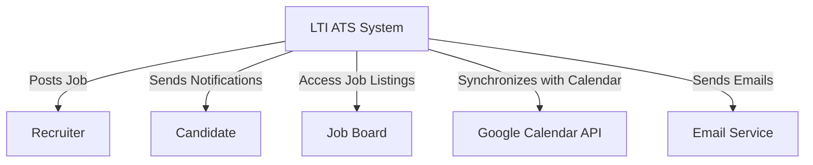
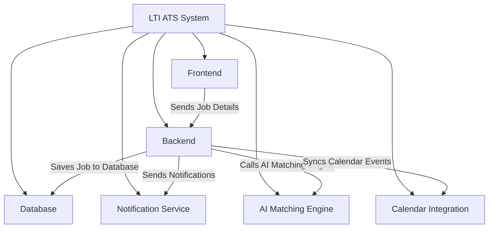
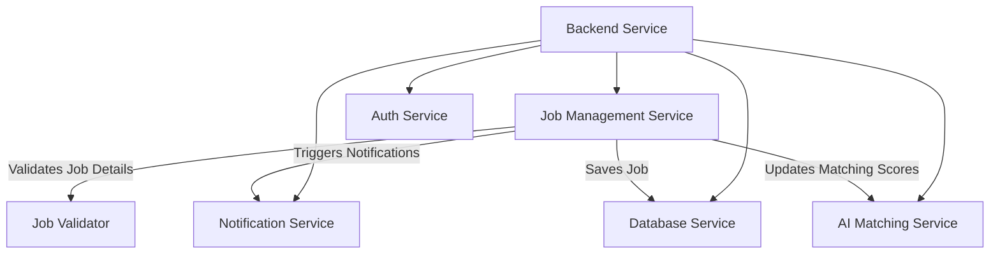
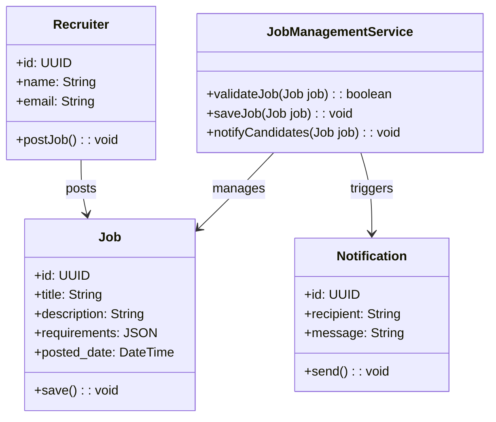

# Brief Description of the LTI Software

Here's a brief description of LTI Software, focusing on the value it adds and the competitive advantages, along with the main functions:

### **LTI Software Overview**

LTI is a next-generation Applicant-Tracking System (ATS) designed to revolutionize the recruitment process for HR departments. It is built with cutting-edge automation and AI integration to streamline tasks, optimize recruiter-manager collaboration, and enhance the candidate experience. LTI aims to offer more than traditional ATS by incorporating real-time features, personalized interactions, and decision-making insights powered by AI.

### **Value Added & Competitive Advantages**

1. **Efficiency Boost for HR Departments**: LTI automates repetitive administrative tasks like CV screening, scheduling interviews, and sending follow-up emails, freeing HR teams to focus on strategic decision-making.

2. **Real-time Collaboration**: LTI offers a seamless environment for recruiters and hiring managers to work together, sharing candidate notes, interview feedback, and updates in real time. This feature improves transparency and speeds up the decision-making process.

3. **AI-Driven Insights**: Leveraging AI, LTI provides recommendations for candidate matches, predicts hiring success based on historical data, and highlights potential bottlenecks in the hiring process. This makes recruiting smarter and faster.

4. **Customizable Automation**: LTI allows users to create custom workflows for automating their recruitment pipeline, such as sending out tailored interview reminders, setting up auto-follow-ups, and creating offer letter templates. This provides flexibility and personalization.

5. **Data-Driven Decision Making**: LTI integrates analytics and reporting tools to offer insights into recruitment trends, recruiter performance, diversity hiring, and time-to-hire metrics. These reports enable continuous improvement of hiring strategies.

6. **Mobile-First Approach**: With mobile-friendly features, LTI allows recruiters and hiring managers to stay updated, review candidates, and make decisions from anywhere.

### **Key Functionalities**

1. **Candidate Sourcing & Management**:

   - Centralized dashboard for managing all candidates.
   - AI-powered candidate ranking and matching.
   - Customizable job listings that can be posted across multiple platforms (e.g., LinkedIn, Indeed).

2. **Automated Resume Screening**:

   - Automatic parsing and ranking of resumes based on job requirements.
   - Pre-screening questionnaires to filter out unqualified applicants.

3. **Interview Scheduling**:

   - Integrated scheduling tool with calendar syncing for real-time availability.
   - Automated interview reminders sent to candidates and interviewers.

4. **Collaboration & Communication Tools**:

   - Shared workspaces for recruiters and managers with real-time feedback on candidates.
   - Instant messaging to streamline internal communication.
   - Email and SMS integrations to maintain contact with candidates.

5. **Reporting & Analytics**:

   - Real-time analytics dashboards showing key recruitment metrics.
   - Custom reports for tracking diversity, equity, and inclusion (DEI) goals.
   - Time-to-hire, cost-per-hire, and applicant pipeline health metrics.

6. **AI-Powered Candidate Matching**:

   - AI algorithms to recommend top candidates based on job descriptions and company culture fit.
   - Predictive analytics for assessing candidate success likelihood in roles based on past hires.

7. **Onboarding Automation**:

   - Automated offer letter generation and digital signatures.
   - New hire documentation management.
   - Post-hire follow-up reminders for both HR and new employees.

8. **Compliance & Data Security**:
   - Built-in tools to manage GDPR, EEO, and other compliance requirements.
   - Secure candidate data storage with role-based access for HR teams.

By focusing on automation, real-time collaboration, and AI-enhanced decision-making, LTI will become a game-changer for HR departments looking to improve their hiring efficiency, make data-driven decisions, and provide a better experience for both recruiters and candidates.

## Lean Canvas diagram

# Description of the 3 Main Use Cases

Here are three main use cases for LTI:

### **Use Case 1: Automated Candidate Screening and Ranking**

**Description**: This use case focuses on the system automatically screening and ranking candidates based on the job requirements, using AI to filter out unqualified candidates and prioritize top applicants for the recruiter’s review.

#### Actors:

- **Recruiter**: Reviews candidates shortlisted by the system.
- **ATS System (LTI)**: Automates screening and ranking.

#### Steps:

1. Recruiter posts a job description.
2. LTI parses resumes and compares them against job requirements.
3. LTI ranks candidates using AI algorithms.
4. LTI generates a shortlist for the recruiter.
5. Recruiter reviews the ranked list.

### **Use Case 2: Interview Scheduling and Management**

**Expanded Description**: LTI automates interview scheduling by integrating with external calendar services, syncing availability for both interviewers and candidates, proposing suitable times, and managing automated reminders. The system reduces the administrative workload on recruiters while ensuring candidates and interviewers are well-informed and on time for interviews.

#### Actors:

- **Recruiter**: Selects candidates and finalizes interview times.
- **Candidate**: Receives interview details and responds with their availability.
- **ATS System (LTI)**: Handles scheduling, calendar syncing, and reminders.
  - **Calendar Sync Module**: Syncs availability across different calendar services.
  - **Scheduler Engine**: Proposes optimal interview times based on availability.
  - **Notification System**: Sends reminders and confirmations to all parties.

#### Detailed Steps:

1. **Recruiter selects candidates** for interviews and initiates scheduling within LTI.
2. **Calendar Sync Module** pulls availability from recruiter and interviewer calendars (Google Calendar, Outlook, etc.).
3. **Scheduler Engine** checks candidate availability and proposes suitable interview times based on overlapping free time.
4. **LTI sends proposed interview times** to candidates for confirmation.
5. **Candidate confirms or requests reschedule**, which is processed by the Scheduler Engine.
6. **Scheduler Engine finalizes** the interview time, syncing calendars with the confirmed slot.
7. **Notification System sends automatic reminders** to both recruiters and candidates, leading up to the interview.
8. **Interviews are conducted**, and post-interview follow-ups or evaluations are scheduled as needed.

### **Diagram**:

This expanded diagram shows the interactions inside LTI, highlighting internal components like the Calendar Sync Module, Scheduler Engine, and Notification System.

### Explanation of Internal Components:

1. **Calendar Sync Module**:

   - Integrates with external calendar services (Google, Outlook) to fetch real-time availability of recruiters, interviewers, and candidates.
   - Resolves time zone differences and ensures accurate scheduling.

2. **Scheduler Engine**:

   - Proposes interview times by finding overlaps in available time slots between recruiters, interviewers, and candidates.
   - Handles rescheduling requests and dynamically adjusts available slots.

3. **Notification System**:
   - Sends email and/or SMS reminders to all parties before the interview.
   - Sends interview details and calendar invitations with automatic updates for changes or reschedules.

### **Use Case 3: AI-Powered Candidate Matching and Recommendation**

**Expanded Description**: LTI uses multiple internal modules to match candidates with job requirements. The system first analyzes job profiles, scans the candidate database, applies AI-driven matching algorithms, and finally recommends the best candidates based on skill matching and past performance metrics.

#### Actors:

- **Recruiter**: Receives AI-recommended candidates.
- **ATS System (LTI)**: Executes the candidate matching process.
  - **Job Profile Parser**: Analyzes the job requirements.
  - **Candidate Profile Scanner**: Searches for relevant candidates in the database.
  - **AI Matching Engine**: Applies matching algorithms to pair candidates with job requirements.
  - **Recommendation Generator**: Creates and prioritizes candidate recommendations based on fit.

#### Detailed Steps:

1. **Recruiter posts a job** with required skills, qualifications, and experience.
2. **Job Profile Parser** analyzes the job requirements and creates a structured set of attributes.
3. **Candidate Profile Scanner** searches through the database for candidate profiles that match the job’s structured attributes.
4. **AI Matching Engine** evaluates the candidates using skill matching, job experience, and past performance data.
5. **Recommendation Generator** ranks candidates based on their fit and generates a prioritized recommendation list.
6. **Recruiter receives the recommended list** and reviews candidates.

#### Diagram:

### Explanation of Internal Components:

- **Job Profile Parser**: Breaks down job descriptions into structured data points such as skills, qualifications, and experience.
- **Candidate Profile Scanner**: Filters through candidate profiles in the database to identify potential matches.
- **AI Matching Engine**: Uses advanced algorithms to evaluate candidates based on the parsed job attributes, past hiring data, and candidate profiles.
- **Recommendation Generator**: Ranks candidates based on their suitability for the role, creating a prioritized list for recruiters.

# Data Model

As a software architect, we can break down the **LTI Applicant-Tracking System (ATS)** into key entities that will support its core functionalities, such as **automated candidate screening**, **interview scheduling**, and **AI-powered candidate matching**. The data model will define entities, attributes, and relationships essential for these processes.

### **Entities, Attributes, and Relationships**:

#### **1. Recruiter**

- **Attributes**:
  - **id** (UUID): Unique identifier for the recruiter.
  - **name** (String): Full name of the recruiter.
  - **email** (String): Email address.
  - **phone** (String): Phone number.
  - **role** (String): Role within the company (e.g., Senior Recruiter, HR Manager).
  - **calendar_id** (String): Identifier linking to the recruiter's calendar.

#### **2. Candidate**

- **Attributes**:
  - **id** (UUID): Unique identifier for the candidate.
  - **name** (String): Full name of the candidate.
  - **email** (String): Email address.
  - **phone** (String): Contact number.
  - **resume** (Text/BLOB): Resume or CV document.
  - **profile** (JSON): JSON object representing parsed data from the resume (skills, experience, education).
  - **status** (Enum): Current status in the recruitment process (e.g., Applied, Interview Scheduled, Hired, Rejected).

#### **3. Job**

- **Attributes**:
  - **id** (UUID): Unique identifier for the job posting.
  - **title** (String): Job title.
  - **description** (Text): Full job description.
  - **requirements** (JSON): Parsed list of required skills, experience, and qualifications.
  - **posted_date** (DateTime): Date when the job was posted.
  - **status** (Enum): Current status of the job (e.g., Open, Closed, Filled).

#### **4. Application**

- **Attributes**:
  - **id** (UUID): Unique identifier for the application.
  - **candidate_id** (UUID): Foreign key referencing **Candidate**.
  - **job_id** (UUID): Foreign key referencing **Job**.
  - **applied_date** (DateTime): Date when the candidate applied.
  - **status** (Enum): Application status (e.g., Pending, Screened, Interview Scheduled, Hired).
  - **screening_score** (Float): Score from the automated resume screening.

#### **5. Interview**

- **Attributes**:
  - **id** (UUID): Unique identifier for the interview.
  - **application_id** (UUID): Foreign key referencing **Application**.
  - **scheduled_date** (DateTime): Date and time when the interview is scheduled.
  - **location** (String): Virtual or physical location (e.g., Zoom link or office address).
  - **status** (Enum): Status of the interview (e.g., Scheduled, Completed, Cancelled).
  - **feedback** (Text): Feedback provided by the interviewer.

#### **6. Calendar**

- **Attributes**:
  - **id** (UUID): Unique identifier for the calendar.
  - **owner_id** (UUID): Foreign key referencing either **Recruiter** or **Candidate**.
  - **owner_type** (Enum): Type of owner (Recruiter or Candidate).
  - **availability** (JSON): Available time slots for scheduling (represented in a JSON structure).

#### **7. AI Matching Engine**

- **Attributes**:
  - **id** (UUID): Unique identifier for the match record.
  - **job_id** (UUID): Foreign key referencing **Job**.
  - **candidate_id** (UUID): Foreign key referencing **Candidate**.
  - **matching_score** (Float): Score calculated by the AI engine based on the candidate’s profile and job requirements.
  - **recommendation_status** (Enum): Status of the recommendation (e.g., Recommended, Not Recommended).

#### **8. Notification**

- **Attributes**:
  - **id** (UUID): Unique identifier for the notification.
  - **recipient_id** (UUID): Foreign key referencing **Recruiter** or **Candidate**.
  - **recipient_type** (Enum): Type of recipient (Recruiter or Candidate).
  - **message** (Text): Notification content.
  - **sent_date** (DateTime): Date and time when the notification was sent.
  - **status** (Enum): Status of the notification (Sent, Failed, Pending).

### **Entity Relationships**:

- **Recruiter** posts **Job** listings. (One-to-Many)
- **Candidate** applies to **Job** listings through **Application**. (One-to-Many)
- **Application** can have one or more **Interview** records. (One-to-Many)
- **Calendar** stores **availability** for both **Recruiters** and **Candidates**. (One-to-One)
- **AI Matching Engine** matches **Candidates** to **Jobs** based on **Profile** and **Job Requirements**. (Many-to-Many)
- **Notifications** are sent to **Recruiters** or **Candidates** to keep them updated. (One-to-Many)

### **Explanation of Key Relationships**:

- **One-to-Many**: A **Recruiter** can post multiple **Jobs**. A **Candidate** can apply to multiple **Jobs** through different **Applications**. Each **Application** can have multiple **Interviews** scheduled.
- **Many-to-Many**: The **AI Matching Engine** can evaluate multiple **Candidates** for a single **Job** and match a single **Candidate** to multiple **Jobs**.
- **One-to-One**: Both **Recruiters** and **Candidates** will have their own **Calendar**, which is used to schedule interviews.

### System Design and High-Level Architecture for the LTI ATS

To design the LTI Applicant Tracking System, we’ll define the high-level components of the system, their responsibilities, and how they interact. The architecture should support the core functionalities like **candidate screening**, **interview scheduling**, **real-time collaboration**, and **AI-powered matching**. We'll focus on scalability, modularity, and integration with external systems.

### **Key Components of the System**:

1. **Frontend (UI Layer)**
2. **Backend (Application Layer)**
3. **Database Layer**
4. **AI Services**
5. **External Integrations (Calendar, Email, etc.)**

---

### **1. Frontend (UI Layer)**:

The user interface will allow recruiters, managers, and candidates to interact with the system, manage applications, and schedule interviews. It should be user-friendly and responsive.

#### **Responsibilities**:

- Candidate and recruiter dashboards
- Job postings, application management
- Interview scheduling UI
- Notifications and reminders

#### **Tech Stack**:

- **React.js** (for fast and interactive UIs)
- **Redux** (for managing application state)
- **Material-UI** or **Tailwind CSS** (for UI components)
- **WebSocket or Polling** (for real-time notifications)

#### **Frontend Components**:

- **Recruiter Dashboard**: Manage job postings, candidate screening, interview scheduling.
- **Candidate Portal**: View job applications, upload resumes, track interview status.
- **Interview Scheduling Interface**: Calendar sync, time selection, rescheduling options.
- **Notification Center**: Real-time notifications for interviews, reminders, or job updates.

---

### **2. Backend (Application Layer)**:

The backend services handle the core business logic, processing requests, and interacting with the database and external APIs.

#### **Responsibilities**:

- Application and job posting management
- Interview scheduling engine
- AI-driven candidate matching and resume screening
- User authentication and authorization
- Notifications and real-time updates

#### **Tech Stack**:

- **Node.js / Express** (for scalable, event-driven server)
- **TypeScript** (for strict typing and maintainability)
- **GraphQL** (for efficient querying from the frontend)
- **Redis** (for caching data and session management)
- **WebSockets** (for real-time communication)

#### **Backend Components**:

- **Job Management Service**: Handles job postings, updates, and candidate applications.
- **Interview Scheduler Service**: Interacts with external calendar APIs, proposes times, manages reminders.
- **AI Matching Service**: Uses machine learning models to match candidates with job requirements.
- **Notification Service**: Sends email, SMS, or push notifications.
- **Authentication and Authorization**: Manages user roles (Recruiter, Manager, Candidate).

---

### **3. Database Layer**:

This layer stores persistent data for candidates, jobs, interviews, and application statuses. It should be designed to handle large-scale data efficiently and enable quick searches for candidates and jobs.

#### **Responsibilities**:

- Store user data (Recruiters, Candidates)
- Manage job listings, applications, and interview schedules
- Store AI matching scores, job requirements, and candidate profiles

#### **Tech Stack**:

- **PostgreSQL**: For relational data (e.g., job postings, applications, users).
- **MongoDB**: For unstructured data (e.g., resumes, job requirements, candidate profiles).
- **ElasticSearch**: For fast, full-text searching (e.g., candidate searches by skill, job requirements).

#### **Database Schema**:

- **Relational DB (PostgreSQL)**: Stores jobs, applications, interviews, and user data.
- **Document DB (MongoDB)**: Stores resumes, AI profiles, job descriptions.
- **Search Index (ElasticSearch)**: Indexes resumes and jobs for quick lookups.

---

### **4. AI Services**:

The AI services will be responsible for the automated resume screening, candidate matching, and potentially, interview scoring. These services may operate independently, processing data and feeding results back into the system.

#### **Responsibilities**:

- Resume parsing and candidate profiling
- Job-candidate matching based on AI algorithms
- Sentiment analysis or interview scoring (future extension)

#### **Tech Stack**:

- **Python**: For AI and machine learning models.
- **TensorFlow / PyTorch**: For training and running AI models.
- **REST API**: Exposes AI capabilities as a service for the application backend.

#### **AI Components**:

- **Resume Parser**: Converts candidate resumes into structured data (skills, experience).
- **Candidate Matching Engine**: Compares candidate profiles against job requirements and generates a matching score.
- **Sentiment Analysis**: Future extension that analyzes interview feedback and performance.

---

### **5. External Integrations**:

LTI will need to integrate with several external services to provide a seamless experience for recruiters and candidates.

#### **Responsibilities**:

- Calendar synchronization (Google Calendar, Outlook)
- Email and SMS notifications
- Resume parsing via third-party services (optional)

#### **Tech Stack**:

- **Google Calendar API**: Sync recruiter and candidate calendars for scheduling interviews.
- **Outlook Calendar API**: For enterprise-level integration.
- **Twilio / SendGrid**: For sending SMS and email notifications.

#### **External Components**:

- **Calendar Sync Module**: Queries available times, proposes interviews, manages rescheduling.
- **Notification Module**: Sends reminders and updates through email or SMS.
- **Resume Parsing (Optional)**: Integrates with third-party services to extract structured data from resumes.

### **High-Level Architecture Diagram**

### **Explanation of High-Level Architecture**:

1. **Frontend (UI Layer)**: Recruiters and candidates interact with the system via the UI. All actions (e.g., applying for jobs, scheduling interviews) are processed by the backend through **GraphQL** APIs. Real-time updates (e.g., notifications, interview reminders) are handled using **WebSockets**.

2. **Backend (Application Layer)**: The backend orchestrates all business logic, handles job applications, interview scheduling, and integrates with AI services for candidate matching. It also connects to external services like calendars and sends notifications.

3. **Database Layer**: Data is stored across different databases, optimized for their respective use cases. **PostgreSQL** handles structured relational data, **MongoDB** stores unstructured resume data, and **ElasticSearch** provides fast search capabilities for job-candidate queries.

4. **AI Services**: These independent services parse resumes, match candidates with job requirements, and provide insights to recruiters. The **Candidate Matching Engine** generates matching scores for every job application, which is stored in the database and used for decision-making.

5. **External Integrations**: Calendar APIs allow recruiters and candidates to sync their interview schedules, while email and SMS services (Twilio, SendGrid) handle notifications.

---

### **Scaling Considerations**:

- **Microservices**: The backend can be broken into microservices to scale independently (e.g., Job Management, Interview Scheduling).
- **Caching**: Use **Redis** for session management and caching frequent queries to reduce database load.
- **Queueing System**: Use message queues (e.g., RabbitMQ or AWS SQS) for asynchronous tasks like sending notifications or running AI jobs.
- **Load Balancing**: Use load balancers to distribute incoming traffic across multiple backend instances to ensure high availability.

# C4 Model Overview

Creating a C4 model (Context, Container, Component, and Code) diagram for the "Posting a Job" process in the LTI Applicant Tracking System will help visualize the interactions and details involved in this specific functionality. Here’s how we can break it down into C4 diagrams.

### **C4 Model Overview**

#### **1. Context Diagram**

This diagram shows the high-level view of the system, its external entities, and how they interact with the ATS.

### **Context Diagram Explanation**:

- **LTI ATS System**: The central system where the job posting process occurs.
- **Recruiter**: The primary actor who posts jobs and manages them.
- **Candidate**: Receives notifications and applies for jobs.
- **Job Board**: External system or interface where jobs are displayed.
- **Google Calendar API**: Used for syncing interview schedules after posting jobs.
- **Email Service**: Handles sending notifications to candidates.

---

#### **2. Container Diagram**

This diagram shows the main containers within the ATS and how they interact during the job posting process.

### **Container Diagram Explanation**:

- **Frontend**: User interface where the recruiter interacts to post jobs.
- **Backend**: Handles business logic for job posting, including validation, storage, and interaction with other services.
- **Database**: Stores job postings, details, and related data.
- **AI Matching Engine**: Assists in job posting by analyzing job requirements and updating matching scores for candidates.
- **Notification Service**: Sends notifications to candidates about the newly posted job.
- **Calendar Integration**: Syncs job-related dates with the calendar for scheduling interviews.

## 

#### **3. Component Diagram**

This diagram shows the internal components of the Backend and how they interact during the job posting process.

### **Component Diagram Explanation**:

- **Job Management Service**: Core service responsible for handling job postings.
- **Notification Service**: Sends emails or notifications to inform candidates of the new job.
- **AI Matching Service**: Analyzes the posted job against existing candidate profiles.
- **Auth Service**: Ensures that only authorized recruiters can post jobs.
- **Database Service**: Manages all database interactions, including job storage.
- **Job Validator**: Validates the job details before saving to the database.

## 

---

#### **4. Code Diagram (Class Diagram)**

This diagram provides a simplified class structure for the job posting process.

### **Code Diagram Explanation**:

- **Recruiter**: Represents the recruiter entity who can post jobs.
- **Job**: Represents the job being posted, with its attributes and methods.
- **Notification**: Represents the notification sent to candidates.
- **JobManagementService**: Contains methods to validate, save jobs, and notify candidates.

## 

---

### Summary of "Posting a Job" Process in C4 Model

- **Context Diagram** illustrates the high-level interactions between the ATS and its external entities.
- **Container Diagram** breaks down the architecture of the system into its main components and shows how they interact during the job posting process.
- **Component Diagram** dives deeper into the backend to show the specific services involved in job management and their interactions.
- **Code Diagram** provides a class structure that outlines the key entities and their relationships.

This C4 diagram series provides a comprehensive overview of the "Posting a Job" process, making it easier for developers and stakeholders to understand the architecture and interactions within the LTI ATS.dddd
