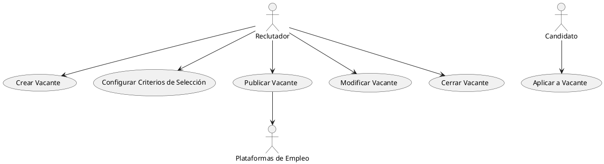
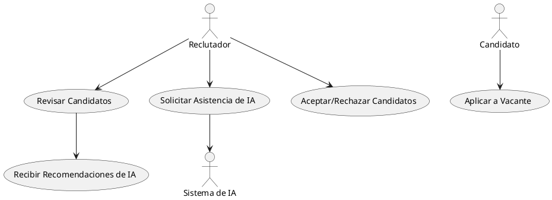
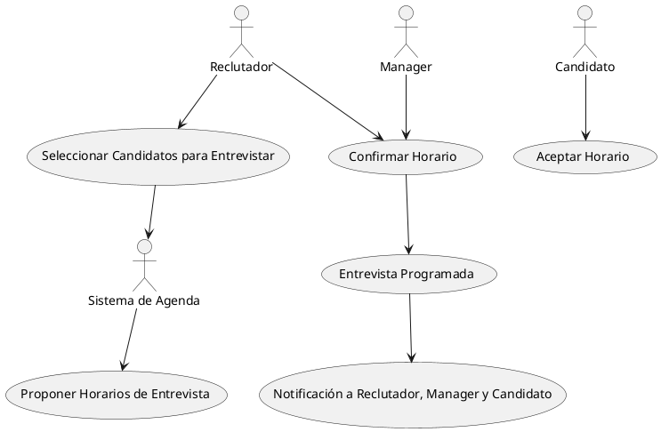
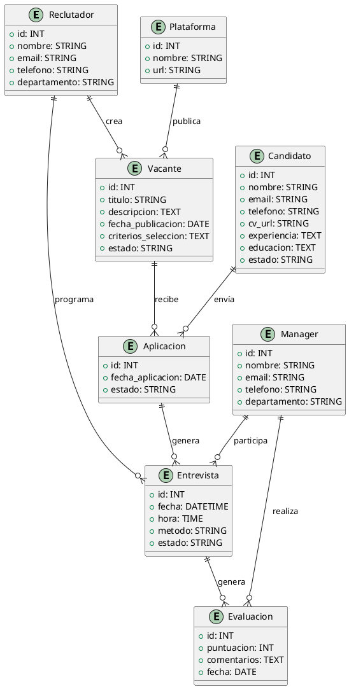

## Descripción breve del sistema LTI (Applicant-Tracking System)

LTI es una plataforma de gestión del ciclo completo de reclutamiento, diseñada para optimizar los procesos de selección de personal en empresas. El sistema combina automatización, inteligencia artificial y colaboración en tiempo real para mejorar la eficiencia de los departamentos de recursos humanos (HR), permitir una mayor comunicación entre reclutadores y managers, y mejorar la experiencia de candidatos y usuarios.

LTI se posiciona como una herramienta moderna y flexible que agiliza el proceso de contratación, desde la creación de vacantes hasta la incorporación del empleado, con el objetivo de disminuir los tiempos de contratación, mejorar la calidad de los candidatos seleccionados y facilitar la toma de decisiones con base en datos.

### Valor añadido y ventajas competitivas

1. **Colaboración en tiempo real**: LTI permite la comunicación fluida entre reclutadores y managers mediante una plataforma colaborativa que integra chat, comentarios y anotaciones en los perfiles de candidatos. Esto mejora la toma de decisiones y evita demoras en el proceso de selección.

2. **Automatización avanzada**: La plataforma automatiza tareas repetitivas, como el filtrado de currículums, programación de entrevistas y respuestas automáticas a los candidatos, ahorrando tiempo a los equipos de HR y eliminando errores manuales.

3. **Asistencia de IA**: Utilizando algoritmos de inteligencia artificial, LTI puede sugerir candidatos más adecuados para un puesto basado en sus habilidades, experiencias y análisis de perfiles. Además, puede predecir la idoneidad de un candidato para la cultura de la empresa.

4. **Análisis basado en datos**: LTI proporciona informes detallados sobre el rendimiento de los procesos de selección, permitiendo a los equipos de HR medir y mejorar su efectividad en la contratación. Métricas como el tiempo de contratación, la calidad de los candidatos, y el costo por contratación están siempre disponibles.

5. **Experiencia del candidato mejorada**: La plataforma se enfoca en brindar una experiencia sencilla y amigable para los candidatos, con procesos de aplicación simplificados, comunicación continua durante todo el ciclo de selección, y un portal donde pueden hacer seguimiento de su postulación.

### Funciones principales del sistema LTI

1. **Gestión de vacantes**: Creación, publicación y gestión centralizada de ofertas de empleo en múltiples canales (páginas de empleo, redes sociales, portales de empleo).
   
2. **Automatización del filtrado de candidatos**: Filtrado automático de currículums y selección de los perfiles más adecuados con base en criterios configurables (palabras clave, habilidades, experiencia).

3. **Programación de entrevistas automatizada**: Coordinación automática de entrevistas entre los reclutadores y los candidatos, integrando agendas y eliminando conflictos de horarios.

4. **Colaboración en tiempo real**: Herramientas de chat y colaboración para que managers y reclutadores discutan perfiles en tiempo real, hagan anotaciones y tomen decisiones rápidas.

5. **Asistencia de IA**: Algoritmos de IA para recomendar candidatos, detectar posibles "mejores ajustes" y predecir el rendimiento de los empleados con base en datos históricos.

6. **Evaluación y retroalimentación**: Facilita la evaluación de candidatos a través de plantillas configurables y permite a los reclutadores compartir feedback con managers de forma rápida y organizada.

7. **Análisis y reportes**: Herramientas avanzadas de reporting que miden indicadores clave como el tiempo de contratación, la efectividad de los reclutadores, la diversidad en las contrataciones, entre otros.

8. **Portal de candidatos**: Un espacio donde los postulantes pueden seguir el estado de su candidatura, actualizar su información y recibir retroalimentación o mensajes del equipo de selección.

### Lean Canvas para el modelo de negocio

Aquí te dejo un diagrama de Lean Canvas para LTI:

| Sección              | Detalle                                                                 |
|----------------------|-------------------------------------------------------------------------|
| **Problema**          | - Proceso de contratación lento y manual - Falta de colaboración en tiempo real entre reclutadores y managers - Poca optimización y visibilidad del ciclo de contratación |
| **Segmentos de Clientes** | - Departamentos de Recursos Humanos en empresas medianas y grandes - Empresas de reclutamiento - Startups en crecimiento |
| **Propuesta de Valor** | - Acelerar el ciclo de contratación - Colaboración en tiempo real entre reclutadores y managers - Asistencia de IA en filtrado y selección de candidatos |
| **Solución**          | - Plataforma colaborativa con automatizaciones avanzadas - Filtrado de candidatos basado en IA - Métricas y análisis del proceso de selección |
| **Canales**           | - Marketing digital (SEO, SEM, redes sociales) - Ventas directas a grandes empresas - Asociaciones con portales de empleo |
| **Estructura de Costos** | - Desarrollo de software - Mantenimiento y soporte técnico - Costes de infraestructura en la nube |
| **Flujos de Ingresos** | - Modelo de suscripción mensual o anual - Licencias por volumen de usuarios o vacantes - Tarifas adicionales por módulos avanzados (análisis, IA, etc.) |
| **Métricas Clave**    | - Tiempo promedio de contratación - Número de candidatos procesados por mes - Tasa de aceptación de candidatos |
| **Ventaja Competitiva** | - Automatización basada en IA - Colaboración en tiempo real - Análisis detallado y personalizable |

Este Lean Canvas te ofrece una visión general del modelo de negocio, destacando cómo la plataforma LTI puede generar valor tanto para los clientes (equipos de HR) como para los candidatos y usuarios finales.

## Casos de Uso

---

### Caso de uso 1: **Gestión de Vacantes**

**Descripción**: El reclutador accede al sistema LTI para crear, configurar y publicar vacantes en diferentes plataformas de empleo. También puede modificar o cerrar vacantes según sea necesario.

---

### Caso de uso 2: **Filtrado y Selección Automática de Candidatos**

**Descripción**: El sistema filtra automáticamente los currículums de los candidatos basándose en los criterios predefinidos por el reclutador. La IA sugiere los mejores candidatos, y el reclutador revisa las recomendaciones.

---

### Caso de uso 3: **Programación Automática de Entrevistas**

**Descripción**: El sistema LTI programa automáticamente entrevistas verificando las agendas de reclutadores, managers y candidatos, proponiendo opciones de horario y enviando notificaciones.

---

Estos diagramas en formato PlantUML representan las interacciones clave entre los actores y el sistema LTI para los tres casos de uso principales: la gestión de vacantes, la selección automatizada de candidatos, y la programación de entrevistas.

¡Perfecto! Dado que ya he descrito los tres casos de uso principales, ahora propongo un **Modelo de Datos UML** utilizando PlantUML que atienda específicamente a esos casos. Este modelo refleja las entidades y relaciones necesarias para cubrir las funcionalidades clave del sistema LTI (Applicant-Tracking System), alineado con la **gestión de vacantes**, **filtrado y selección automática de candidatos**, y la **programación de entrevistas**.

## Modelo de Datos UML

Este modelo cubre las entidades principales: **Reclutador**, **Candidato**, **Vacante**, **Aplicación**, **Entrevista**, **Evaluación**, y **Plataforma**. También define los atributos necesarios para cada entidad y las relaciones entre ellas, enfocadas en los tres casos de uso.

### **Descripción del Modelo de Datos:**

#### Entidades:

1. **Reclutador**:
   - **Descripción**: Responsable de la creación y gestión de vacantes, así como de la programación de entrevistas.
   - **Atributos**:
     - `id` (INT): Identificador único.
     - `nombre` (STRING): Nombre del reclutador.
     - `email` (STRING): Correo electrónico.
     - `telefono` (STRING): Número de contacto.
     - `departamento` (STRING): Departamento del reclutador.

2. **Candidato**:
   - **Descripción**: Persona que aplica a las vacantes, participa en entrevistas y es evaluada por reclutadores y managers.
   - **Atributos**:
     - `id` (INT): Identificador único.
     - `nombre` (STRING): Nombre del candidato.
     - `email` (STRING): Correo electrónico.
     - `telefono` (STRING): Número de contacto.
     - `cv_url` (STRING): Enlace al currículum vitae.
     - `experiencia` (TEXT): Descripción de la experiencia laboral.
     - `educacion` (TEXT): Formación académica.
     - `estado` (STRING): Estado del candidato en el proceso de selección.

3. **Vacante**:
   - **Descripción**: Representa un puesto de trabajo que puede ser gestionado por reclutadores y a donde los candidatos pueden aplicar.
   - **Atributos**:
     - `id` (INT): Identificador único.
     - `titulo` (STRING): Título del puesto.
     - `descripcion` (TEXT): Descripción detallada del puesto.
     - `fecha_publicacion` (DATE): Fecha en la que se publicó la vacante.
     - `criterios_seleccion` (TEXT): Criterios predefinidos por el reclutador para filtrar a los candidatos.
     - `estado` (STRING): Estado actual de la vacante (abierta, cerrada, etc.).

4. **Plataforma**:
   - **Descripción**: Diferentes plataformas donde las vacantes se publican (por ejemplo, LinkedIn, Indeed, etc.).
   - **Atributos**:
     - `id` (INT): Identificador único.
     - `nombre` (STRING): Nombre de la plataforma.
     - `url` (STRING): Enlace a la plataforma.

5. **Aplicacion**:
   - **Descripción**: Relaciona a los candidatos con las vacantes a las que aplican.
   - **Atributos**:
     - `id` (INT): Identificador único.
     - `fecha_aplicacion` (DATE): Fecha de la postulación.
     - `estado` (STRING): Estado de la aplicación (en revisión, aceptada, rechazada).

6. **Entrevista**:
   - **Descripción**: Registro de las entrevistas programadas para los candidatos.
   - **Atributos**:
     - `id` (INT): Identificador único.
     - `fecha` (DATETIME): Fecha y hora de la entrevista.
     - `hora` (TIME): Hora específica de la entrevista.
     - `metodo` (STRING): Método de la entrevista (presencial, videollamada, etc.).
     - `estado` (STRING): Estado de la entrevista (pendiente, realizada, cancelada).

7. **Evaluacion**:
   - **Descripción**: Valoraciones realizadas por los reclutadores o managers tras las entrevistas.
   - **Atributos**:
     - `id` (INT): Identificador único.
     - `puntuacion` (INT): Puntuación otorgada al candidato.
     - `comentarios` (TEXT): Observaciones de la evaluación.
     - `fecha` (DATE): Fecha de la evaluación.

8. **Manager**:
   - **Descripción**: Persona que participa en entrevistas y realiza evaluaciones de los candidatos.
   - **Atributos**:
     - `id` (INT): Identificador único.
     - `nombre` (STRING): Nombre del manager.
     - `email` (STRING): Correo electrónico.
     - `telefono` (STRING): Número de contacto.
     - `departamento` (STRING): Departamento del manager.

### **Relaciones**:

- Un **Reclutador** puede crear muchas **Vacantes**.
- Un **Candidato** puede enviar muchas **Aplicaciones** a diferentes **Vacantes**.
- Cada **Aplicacion** puede generar una **Entrevista**.
- Una **Entrevista** puede generar una **Evaluacion** realizada por un **Manager**.
- Un **Manager** puede participar en varias **Entrevistas** y realizar múltiples **Evaluaciones**.
- Las **Vacantes** pueden ser publicadas en varias **Plataformas**.

### **Relación con los Casos de Uso**:
- **Gestión de Vacantes**: La entidad **Reclutador** crea y gestiona las **Vacantes**, que pueden publicarse en varias **Plataformas**.
- **Filtrado y Selección Automática**: Las **Aplicaciones** enviadas por los **Candidatos** son filtradas automáticamente en función de los **criterios_seleccion** definidos en la **Vacante**.
- **Programación de Entrevistas**: Las **Entrevistas** se programan automáticamente para los **Candidatos** seleccionados, y los **Reclutadores** y **Managers** participan en las evaluaciones.

Este modelo proporciona una estructura sólida y escalable para cubrir los casos de uso del sistema LTI y soportar las funcionalidades clave del ATS.