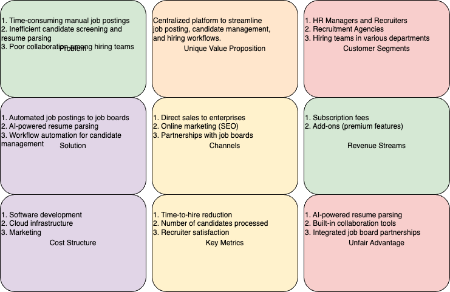
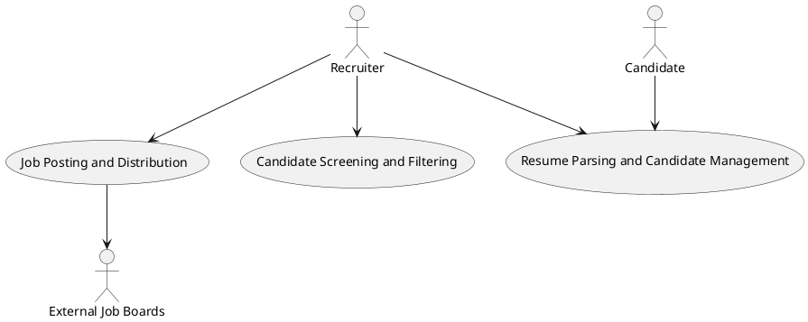
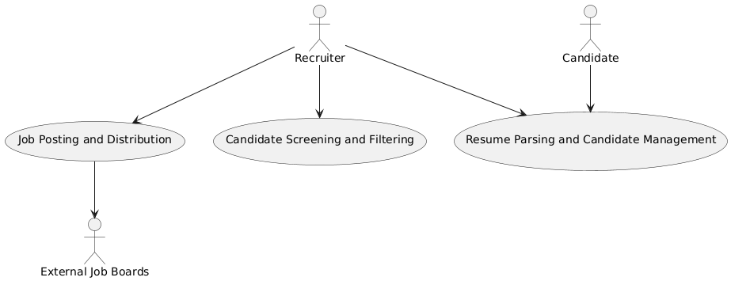
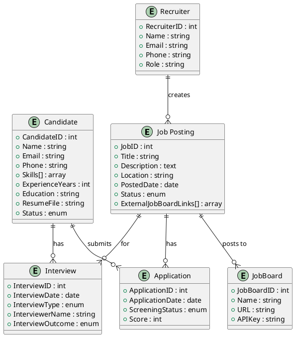
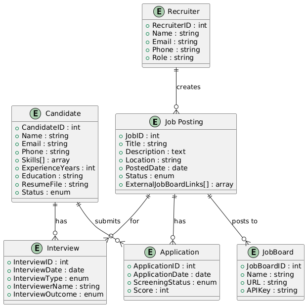
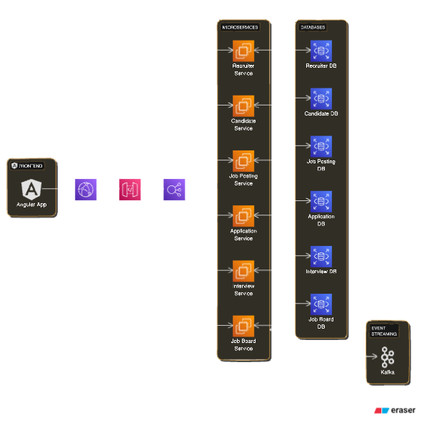

# Prompts

## Prompt 1 - ChatGpt
You are a product expert with experience in ATS (Applicant-Tracking System). Could you define the basic functionalities of a Applicant-Tracking System? Please order from more important to less important.

## Promp 1 - Response
An Applicant Tracking System (ATS) is a software tool that helps organizations streamline their hiring processes by managing recruitment and candidate data more efficiently. Here’s an ordered breakdown of the basic functionalities, from most important to least important:

### 1. **Job Posting and Distribution**
   - **Function**: ATS allows recruiters to create job listings and distribute them to multiple job boards (e.g., Indeed, LinkedIn) from one centralized platform.
   - **Why it’s important**: This functionality helps ensure broad visibility for job openings, attracting a larger pool of candidates.

### 2. **Resume Parsing and Candidate Data Management**
   - **Function**: ATS automatically extracts and categorizes information from resumes (skills, education, experience) and other documents into a searchable database.
   - **Why it’s important**: Reduces manual data entry, speeds up candidate review, and helps recruiters find relevant candidates faster through keyword searches.

### 3. **Candidate Screening and Filtering**
   - **Function**: Allows recruiters to set criteria (e.g., skills, experience, qualifications) to filter out unqualified applicants.
   - **Why it’s important**: Saves time by focusing attention on the most qualified candidates, often using AI-based recommendations.

### 4. **Applicant Communication and Collaboration Tools**
   - **Function**: Provides communication features (e.g., email templates, bulk messaging, interview scheduling) and enables team collaboration (commenting, rating candidates).
   - **Why it’s important**: Keeps candidates engaged and improves coordination among hiring managers and recruiters, leading to smoother hiring workflows.

### 5. **Workflow Automation**
   - **Function**: Automates repetitive tasks like sending follow-up emails, interview scheduling, or moving candidates through different hiring stages (screening, interviews, etc.).
   - **Why it’s important**: Increases recruiter efficiency and reduces delays, allowing them to focus on higher-value activities like interviews and candidate engagement.

### 6. **Interview Management**
   - **Function**: Schedules interviews, sends invitations, and integrates with calendar tools (Google Calendar, Outlook), often supporting different interview formats (phone, video).
   - **Why it’s important**: Simplifies the logistics of coordinating interviews, reducing friction in the process.

### 7. **Candidate Relationship Management (CRM)**
   - **Function**: Maintains a pipeline of past candidates and leads for future openings, offering features like email drip campaigns to keep potential hires engaged.
   - **Why it’s important**: Facilitates proactive hiring by engaging passive candidates and maintaining relationships with previous applicants.

### 8. **Reporting and Analytics**
   - **Function**: Generates reports on key recruitment metrics (e.g., time-to-hire, source of applicants, diversity, and compliance tracking) to evaluate recruitment performance.
   - **Why it’s important**: Provides data-driven insights to improve hiring strategies and resource allocation, and ensures compliance with legal hiring standards.

### 9. **Mobile Accessibility**
   - **Function**: Offers mobile apps or mobile-friendly interfaces for recruiters to manage hiring tasks on the go.
   - **Why it’s important**: Allows for quick, flexible actions and access to the system from anywhere, speeding up decision-making processes.

### 10. **Onboarding Features**
   - **Function**: Some ATS systems extend into onboarding, managing offer letters, background checks, and new hire paperwork.
   - **Why it’s important**: Streamlines the transition from candidate to employee, improving the overall hiring and onboarding experience.

These functionalities ensure that an ATS not only reduces administrative burden but also improves the efficiency and effectiveness of the overall hiring process, with the core focus on attracting, screening, and selecting the best candidates efficiently.

---
# Prompt 2 - ChatGpt
With this information could you generate a Lean Canvas diagram in drawio format please?

## Promp 2 - Response
I have created the Lean Canvas diagram for your Applicant Tracking System (ATS) in Draw.io format. You can download it using the link below:



Feel free to import it into any Draw.io-compatible tool for further customization or visualization.

---

# Prompt 3 - ChatGpt
OK, now you are an expert software analyst. I am building An Applicant Tracking System (ATS) as defined previously. List and briefly describe the three most important use cases to implement for achieving basic functionality. Please explain each case and represent these use cases in the most appropriate diagram type using the PlantUML format.

## Promp 3 - Response

As a software analyst, I'll walk you through the three most important use cases to implement for achieving the core functionality of an ATS. We will focus on job posting and distribution, resume parsing and candidate management, and candidate screening and filtering.

### Use Case 1: **Job Posting and Distribution**
   - **Description**: This use case allows recruiters to create new job postings and distribute them across various job boards. The recruiter enters job details (title, description, requirements) and the system automatically posts it to multiple job boards via integrations.
   - **Actors**: Recruiter, External Job Boards
   - **Basic Flow**:
     1. Recruiter logs into the ATS.
     2. Recruiter creates a new job posting.
     3. Recruiter selects job boards for distribution.
     4. ATS posts the job to selected job boards.
     5. Confirmation is sent to the recruiter.

### Use Case 2: **Resume Parsing and Candidate Management**
   - **Description**: Once candidates apply, their resumes are parsed by the system. This use case involves extracting relevant information (name, contact, skills, experience) and storing it in a searchable format.
   - **Actors**: Candidate, ATS
   - **Basic Flow**:
     1. Candidate submits their resume via the ATS or an integrated job board.
     2. ATS parses the resume, extracting key details.
     3. Parsed data is saved in the ATS as a candidate profile.
     4. Recruiter searches the candidate database to find relevant profiles.

### Use Case 3: **Candidate Screening and Filtering**
   - **Description**: After resumes are parsed and stored, recruiters can filter and screen candidates based on criteria (experience, skills, qualifications). The system ranks or filters out candidates who do not meet the minimum requirements.
   - **Actors**: Recruiter, ATS
   - **Basic Flow**:
     1. Recruiter sets screening criteria (skills, years of experience, location).
     2. ATS filters candidates based on the criteria.
     3. ATS displays a list of matching candidates.
     4. Recruiter reviews shortlisted candidates.

### Diagram Representation: Use Case Diagram in PlantUML
Here is a use case diagram representation of the three main use cases using PlantUML.



### Explanation:
- **Recruiter** is the primary actor interacting with all three use cases.
- **Candidate** is involved in the resume parsing and management use case.
- **External Job Boards** are used in the job posting and distribution use case.

### Diagram generated



---

## Prompt 4 - ChatGpt
You are an expert software architect. What are the essential data model entities in the Applicant Tracking System (ATS) to cover this three main uses cases? Give me some essential fields for each one and how they relate. Could you provide me the model definition and a schema in PlantUML format?

## Prompt 4 - Response
Let's define the essential data model entities for the **Applicant Tracking System (ATS)** based on the three main use cases we previously discussed: **job posting and distribution**, **resume parsing and candidate management**, and **candidate screening and filtering**. I’ll provide a model definition along with the schema in PlantUML format.

### Key Data Model Entities and Relationships

1. **Job Posting**
   - **Description**: Represents the job openings created by recruiters.
   - **Essential Fields**:
     - `JobID` (Primary Key)
     - `Title` (string)
     - `Description` (text)
     - `Location` (string)
     - `PostedDate` (date)
     - `Status` (enum: Open, Closed)
     - `ExternalJobBoardLinks[]` (array of strings)

2. **Candidate**
   - **Description**: Represents individuals who apply for jobs and contains parsed data from resumes.
   - **Essential Fields**:
     - `CandidateID` (Primary Key)
     - `Name` (string)
     - `Email` (string)
     - `Phone` (string)
     - `Skills[]` (array of strings)
     - `ExperienceYears` (integer)
     - `Education` (string)
     - `ResumeFile` (string, URL or path)
     - `Status` (enum: Applied, Screened, Shortlisted, Rejected)

3. **Application**
   - **Description**: Links a candidate to a specific job posting and tracks the application process.
   - **Essential Fields**:
     - `ApplicationID` (Primary Key)
     - `JobID` (Foreign Key to Job Posting)
     - `CandidateID` (Foreign Key to Candidate)
     - `ApplicationDate` (date)
     - `ScreeningStatus` (enum: Under Review, Passed, Rejected)
     - `Score` (integer, optional)

4. **Recruiter**
   - **Description**: Represents recruiters or HR managers who manage job postings and candidates.
   - **Essential Fields**:
     - `RecruiterID` (Primary Key)
     - `Name` (string)
     - `Email` (string)
     - `Phone` (string)
     - `Role` (string)

5. **Interview**
   - **Description**: Tracks interviews scheduled with candidates.
   - **Essential Fields**:
     - `InterviewID` (Primary Key)
     - `CandidateID` (Foreign Key to Candidate)
     - `JobID` (Foreign Key to Job Posting)
     - `InterviewDate` (date)
     - `InterviewType` (enum: Phone, Video, Onsite)
     - `InterviewerName` (string)
     - `InterviewOutcome` (enum: Passed, Failed, Pending)

6. **JobBoard**
   - **Description**: Represents external job boards where job postings can be distributed.
   - **Essential Fields**:
     - `JobBoardID` (Primary Key)
     - `Name` (string)
     - `URL` (string)
     - `APIKey` (string, optional for integrations)

### Relationships
- **Job Posting ↔ Application**: A job posting can have many applications; each application is linked to a specific job and candidate.
- **Candidate ↔ Application**: A candidate can apply to multiple jobs; each application is tracked separately.
- **Recruiter ↔ Job Posting**: A recruiter creates and manages multiple job postings.
- **Job Posting ↔ JobBoard**: A job posting can be linked to multiple job boards.
- **Candidate ↔ Interview**: A candidate can have multiple interviews scheduled.

### PlantUML Schema Definition

Here’s the PlantUML code representing the entities, their fields, and relationships.




### Summary

This data model provides a clear structure for the **Applicant Tracking System**, allowing efficient tracking and management of job postings, candidates, applications, interviews, and the overall recruitment process. If you need further elaboration on any entity or relationship, feel free to ask!

---

## Prompt 5 - Eraser Diagram Gpt
Hi you are an expert software architect. I need a high level system design with an explanation and a diagram based on the following requirements for an Applicant-Tracking System:

I want a microservices based architecture.
Each microservice should have dedicated database.
Event driven design is desired using tools like Kafka, Pulsar or other similar tools.
My cloud provider is AWS
Please include a load balancer and and CDN
An Angular front end communicated through an API Gateway

Here my data model. (er-diagram.png)

## Prompt 4 - Response



## Promt 5 - Chat GPT

And the last thing, could you create a C4 diagram of this Applicant Tracking System? It could be done using drawio format.

## Promt 5 - Response
I can create a C4 diagram for the Applicant Tracking System (ATS) in a single file using the Draw.io format. Below is the XML code that you can use in Draw.io to visualize the C4 model. 

### C4 Diagram for Applicant Tracking System (ATS)

You can copy the following XML and import it directly into Draw.io:

```xml
<mxfile host="app.diagrams.net">
  <diagram name="C4 Diagram" id="0e25aa29-5d54-4654-bd5a-4ca45835c93e">
    <mxGraphModel dx="1435" dy="813" grid="1" gridSize="10" guides="1" tooltips="1" connect="1" arrows="1" fold="1" page="1" pageScale="1" pageWidth="827" pageHeight="1169" math="0" shadow="0">
      <root>
        <mxCell id="0" parent="1"/>
        <mxCell id="1" style="shape=roundedRectangle;whiteSpace=wrap;html=1;fillColor=#D7E8F4;strokeColor=#4A8CBB;strokeWidth=2;" vertex="1" parent="0">
          <mxGeometry x="270" y="120" width="200" height="80" as="geometry"/>
          <mxCell id="2" value="Applicant Tracking System" style="text;html=1;strokeColor=none;fillColor=none;" vertex="1" parent="1">
            <mxGeometry width="200" height="40" as="geometry"/>
          </mxCell>
        </mxCell>
        
        <!-- Context Diagram -->
        <mxCell id="3" style="shape=actor;whiteSpace=wrap;html=1;" vertex="1" parent="0">
          <mxGeometry x="20" y="150" width="40" height="40" as="geometry"/>
          <mxCell id="4" value="Candidate" style="text;html=1;strokeColor=none;fillColor=none;" vertex="1" parent="3">
            <mxGeometry width="60" height="40" as="geometry"/>
          </mxCell>
        </mxCell>

        <mxCell id="5" style="shape=actor;whiteSpace=wrap;html=1;" vertex="1" parent="0">
          <mxGeometry x="20" y="290" width="40" height="40" as="geometry"/>
          <mxCell id="6" value="Recruiter" style="text;html=1;strokeColor=none;fillColor=none;" vertex="1" parent="5">
            <mxGeometry width="60" height="40" as="geometry"/>
          </mxCell>
        </mxCell>

        <mxCell id="7" style="shape=actor;whiteSpace=wrap;html=1;" vertex="1" parent="0">
          <mxGeometry x="20" y="370" width="40" height="40" as="geometry"/>
          <mxCell id="8" value="Job Board" style="text;html=1;strokeColor=none;fillColor=none;" vertex="1" parent="7">
            <mxGeometry width="60" height="40" as="geometry"/>
          </mxCell>
        </mxCell>

        <mxCell id="9" style="shape=actor;whiteSpace=wrap;html=1;" vertex="1" parent="0">
          <mxGeometry x="20" y="450" width="40" height="40" as="geometry"/>
          <mxCell id="10" value="HR System" style="text;html=1;strokeColor=none;fillColor=none;" vertex="1" parent="9">
            <mxGeometry width="60" height="40" as="geometry"/>
          </mxCell>
        </mxCell>

        <!-- Relationships -->
        <mxCell id="11" style="edgeStyle=orthogonalEdgeStyle;rounded=0;orthogonalLoop=1;exitX=0.5;exitY=0;entryX=0.5;entryY=1;exitPerimeter=1;entryPerimeter=1;strokeColor=#4A8CBB;strokeWidth=2;" edge="1" parent="0" source="1" target="4">
          <mxGeometry relative="1" as="geometry"/>
          <mxCell id="12" value="Applies for jobs" style="text;html=1;strokeColor=none;fillColor=none;" vertex="1" parent="11">
            <mxGeometry width="80" height="40" as="geometry"/>
          </mxCell>
        </mxCell>

        <mxCell id="13" style="edgeStyle=orthogonalEdgeStyle;rounded=0;orthogonalLoop=1;exitX=0.5;exitY=0;entryX=0.5;entryY=1;exitPerimeter=1;entryPerimeter=1;strokeColor=#4A8CBB;strokeWidth=2;" edge="1" parent="0" source="1" target="5">
          <mxGeometry relative="1" as="geometry"/>
          <mxCell id="14" value="Manages job postings and candidates" style="text;html=1;strokeColor=none;fillColor=none;" vertex="1" parent="13">
            <mxGeometry width="180" height="40" as="geometry"/>
          </mxCell>
        </mxCell>

        <mxCell id="15" style="edgeStyle=orthogonalEdgeStyle;rounded=0;orthogonalLoop=1;exitX=0.5;exitY=0;entryX=0.5;entryY=1;exitPerimeter=1;entryPerimeter=1;strokeColor=#4A8CBB;strokeWidth=2;" edge="1" parent="0" source="1" target="7">
          <mxGeometry relative="1" as="geometry"/>
          <mxCell id="16" value="Posts job openings" style="text;html=1;strokeColor=none;fillColor=none;" vertex="1" parent="15">
            <mxGeometry width="130" height="40" as="geometry"/>
          </mxCell>
        </mxCell>

        <mxCell id="17" style="edgeStyle=orthogonalEdgeStyle;rounded=0;orthogonalLoop=1;exitX=0.5;exitY=0;entryX=0.5;entryY=1;exitPerimeter=1;entryPerimeter=1;strokeColor=#4A8CBB;strokeWidth=2;" edge="1" parent="0" source="1" target="9">
          <mxGeometry relative="1" as="geometry"/>
          <mxCell id="18" value="Syncs employee data" style="text;html=1;strokeColor=none;fillColor=none;" vertex="1" parent="17">
            <mxGeometry width="120" height="40" as="geometry"/>
          </mxCell>
        </mxCell>
      </root>
    </mxGraphModel>
  </diagram>
</mxfile>
```

### Instructions to Use

1. Go to [Draw.io](https://app.diagrams.net/).
2. Click on **File** > **Import From** > **Device**.
3. Copy the XML code provided above into a text file and save it with a `.drawio` extension.
4. Select the file to upload it to Draw.io.
5. You should see the C4 diagram representing the Applicant Tracking System.

Let me know if you need any further adjustments or additional diagrams!

*_It doesn't work properly and chatgpt reached the limit_*
