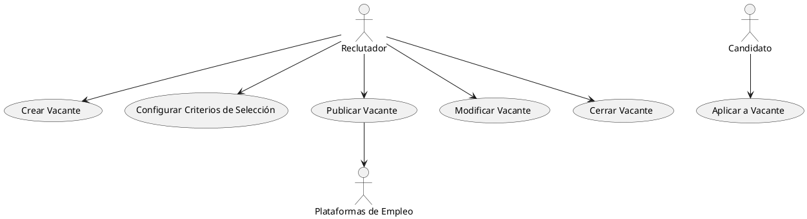
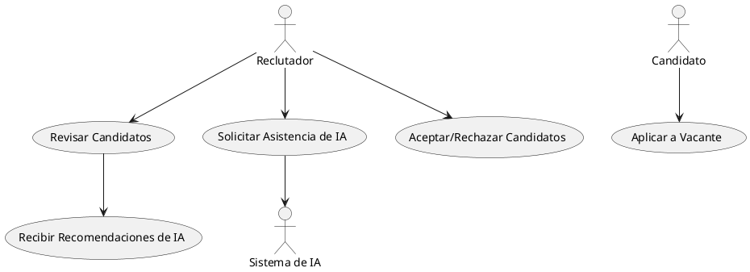
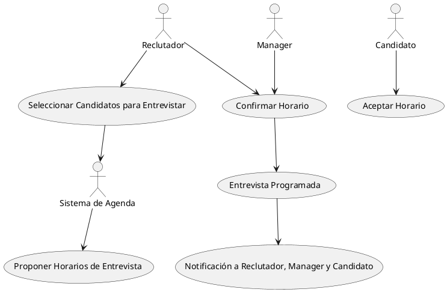
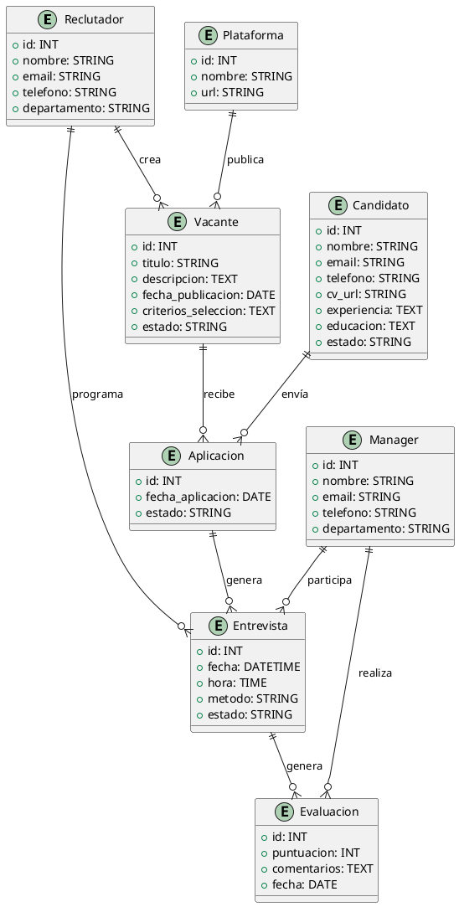
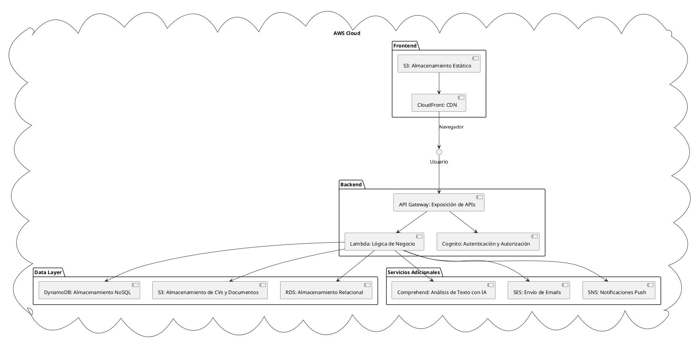
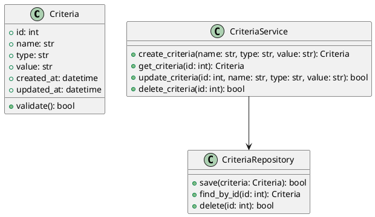

## Descripción breve del sistema LTI (Applicant-Tracking System)

LTI es una plataforma de gestión del ciclo completo de reclutamiento, diseñada para optimizar los procesos de selección de personal en empresas. El sistema combina automatización, inteligencia artificial y colaboración en tiempo real para mejorar la eficiencia de los departamentos de recursos humanos (HR), permitir una mayor comunicación entre reclutadores y managers, y mejorar la experiencia de candidatos y usuarios.

LTI se posiciona como una herramienta moderna y flexible que agiliza el proceso de contratación, desde la creación de vacantes hasta la incorporación del empleado, con el objetivo de disminuir los tiempos de contratación, mejorar la calidad de los candidatos seleccionados y facilitar la toma de decisiones con base en datos.

### Valor añadido y ventajas competitivas

1. **Colaboración en tiempo real**: LTI permite la comunicación fluida entre reclutadores y managers mediante una plataforma colaborativa que integra chat, comentarios y anotaciones en los perfiles de candidatos. Esto mejora la toma de decisiones y evita demoras en el proceso de selección.

2. **Automatización avanzada**: La plataforma automatiza tareas repetitivas, como el filtrado de currículums, programación de entrevistas y respuestas automáticas a los candidatos, ahorrando tiempo a los equipos de HR y eliminando errores manuales.

3. **Asistencia de IA**: Utilizando algoritmos de inteligencia artificial, LTI puede sugerir candidatos más adecuados para un puesto basado en sus habilidades, experiencias y análisis de perfiles. Además, puede predecir la idoneidad de un candidato para la cultura de la empresa.

4. **Análisis basado en datos**: LTI proporciona informes detallados sobre el rendimiento de los procesos de selección, permitiendo a los equipos de HR medir y mejorar su efectividad en la contratación. Métricas como el tiempo de contratación, la calidad de los candidatos, y el costo por contratación están siempre disponibles.

5. **Experiencia del candidato mejorada**: La plataforma se enfoca en brindar una experiencia sencilla y amigable para los candidatos, con procesos de aplicación simplificados, comunicación continua durante todo el ciclo de selección, y un portal donde pueden hacer seguimiento de su postulación.

### Funciones principales del sistema LTI

1. **Gestión de vacantes**: Creación, publicación y gestión centralizada de ofertas de empleo en múltiples canales (páginas de empleo, redes sociales, portales de empleo).
   
2. **Automatización del filtrado de candidatos**: Filtrado automático de currículums y selección de los perfiles más adecuados con base en criterios configurables (palabras clave, habilidades, experiencia).

3. **Programación de entrevistas automatizada**: Coordinación automática de entrevistas entre los reclutadores y los candidatos, integrando agendas y eliminando conflictos de horarios.

4. **Colaboración en tiempo real**: Herramientas de chat y colaboración para que managers y reclutadores discutan perfiles en tiempo real, hagan anotaciones y tomen decisiones rápidas.

5. **Asistencia de IA**: Algoritmos de IA para recomendar candidatos, detectar posibles "mejores ajustes" y predecir el rendimiento de los empleados con base en datos históricos.

6. **Evaluación y retroalimentación**: Facilita la evaluación de candidatos a través de plantillas configurables y permite a los reclutadores compartir feedback con managers de forma rápida y organizada.

7. **Análisis y reportes**: Herramientas avanzadas de reporting que miden indicadores clave como el tiempo de contratación, la efectividad de los reclutadores, la diversidad en las contrataciones, entre otros.

8. **Portal de candidatos**: Un espacio donde los postulantes pueden seguir el estado de su candidatura, actualizar su información y recibir retroalimentación o mensajes del equipo de selección.

### Lean Canvas para el modelo de negocio

Aquí te dejo un diagrama de Lean Canvas para LTI:

| Sección              | Detalle                                                                 |
|----------------------|-------------------------------------------------------------------------|
| **Problema**          | - Proceso de contratación lento y manual<br>- Falta de colaboración en tiempo real entre reclutadores y managers<br>- Poca optimización y visibilidad del ciclo de contratación |
| **Segmentos de Clientes** | - Departamentos de Recursos Humanos en empresas medianas y grandes<br>- Empresas de reclutamiento<br>- Startups en crecimiento |
| **Propuesta de Valor** | - Acelerar el ciclo de contratación<br>- Colaboración en tiempo real entre reclutadores y managers<br>- Asistencia de IA en filtrado y selección de candidatos |
| **Solución**          | - Plataforma colaborativa con automatizaciones avanzadas<br>- Filtrado de candidatos basado en IA<br>- Métricas y análisis del proceso de selección |
| **Canales**           | - Marketing digital (SEO, SEM, redes sociales)<br>- Ventas directas a grandes empresas<br>- Asociaciones con portales de empleo |
| **Estructura de Costos** | - Desarrollo de software<br>- Mantenimiento y soporte técnico<br>- Costes de infraestructura en la nube |
| **Flujos de Ingresos** | - Modelo de suscripción mensual o anual<br>- Licencias por volumen de usuarios o vacantes<br>- Tarifas adicionales por módulos avanzados (análisis, IA, etc.) |
| **Métricas Clave**    | - Tiempo promedio de contratación<br>- Número de candidatos procesados por mes<br>- Tasa de aceptación de candidatos |
| **Ventaja Competitiva** | - Automatización basada en IA<br>- Colaboración en tiempo real<br>- Análisis detallado y personalizable |

Este Lean Canvas te ofrece una visión general del modelo de negocio, destacando cómo la plataforma LTI puede generar valor tanto para los clientes (equipos de HR) como para los candidatos y usuarios finales.


## Casos de Uso

---

### Caso de uso 1: **Gestión de Vacantes**

**Descripción**: El reclutador accede al sistema LTI para crear, configurar y publicar vacantes en diferentes plataformas de empleo. También puede modificar o cerrar vacantes según sea necesario.



---

### Caso de uso 2: **Filtrado y Selección Automática de Candidatos**

**Descripción**: El sistema filtra automáticamente los currículums de los candidatos basándose en los criterios predefinidos por el reclutador. La IA sugiere los mejores candidatos, y el reclutador revisa las recomendaciones.



---

### Caso de uso 3: **Programación Automática de Entrevistas**

**Descripción**: El sistema LTI programa automáticamente entrevistas verificando las agendas de reclutadores, managers y candidatos, proponiendo opciones de horario y enviando notificaciones.



---

Estos diagramas en formato PlantUML representan las interacciones clave entre los actores y el sistema LTI para los tres casos de uso principales: la gestión de vacantes, la selección automatizada de candidatos, y la programación de entrevistas.


¡Perfecto! Dado que ya he descrito los tres casos de uso principales, ahora propongo un **Modelo de Datos UML** utilizando PlantUML que atienda específicamente a esos casos. Este modelo refleja las entidades y relaciones necesarias para cubrir las funcionalidades clave del sistema LTI (Applicant-Tracking System), alineado con la **gestión de vacantes**, **filtrado y selección automática de candidatos**, y la **programación de entrevistas**.

## Modelo de Datos UML

Este modelo cubre las entidades principales: **Reclutador**, **Candidato**, **Vacante**, **Aplicación**, **Entrevista**, **Evaluación**, y **Plataforma**. También define los atributos necesarios para cada entidad y las relaciones entre ellas, enfocadas en los tres casos de uso.



### **Descripción del Modelo de Datos:**

#### Entidades:

1. **Reclutador**:
   - **Descripción**: Responsable de la creación y gestión de vacantes, así como de la programación de entrevistas.
   - **Atributos**:
     - `id` (INT): Identificador único.
     - `nombre` (STRING): Nombre del reclutador.
     - `email` (STRING): Correo electrónico.
     - `telefono` (STRING): Número de contacto.
     - `departamento` (STRING): Departamento del reclutador.

2. **Candidato**:
   - **Descripción**: Persona que aplica a las vacantes, participa en entrevistas y es evaluada por reclutadores y managers.
   - **Atributos**:
     - `id` (INT): Identificador único.
     - `nombre` (STRING): Nombre del candidato.
     - `email` (STRING): Correo electrónico.
     - `telefono` (STRING): Número de contacto.
     - `cv_url` (STRING): Enlace al currículum vitae.
     - `experiencia` (TEXT): Descripción de la experiencia laboral.
     - `educacion` (TEXT): Formación académica.
     - `estado` (STRING): Estado del candidato en el proceso de selección.

3. **Vacante**:
   - **Descripción**: Representa un puesto de trabajo que puede ser gestionado por reclutadores y a donde los candidatos pueden aplicar.
   - **Atributos**:
     - `id` (INT): Identificador único.
     - `titulo` (STRING): Título del puesto.
     - `descripcion` (TEXT): Descripción detallada del puesto.
     - `fecha_publicacion` (DATE): Fecha en la que se publicó la vacante.
     - `criterios_seleccion` (TEXT): Criterios predefinidos por el reclutador para filtrar a los candidatos.
     - `estado` (STRING): Estado actual de la vacante (abierta, cerrada, etc.).

4. **Plataforma**:
   - **Descripción**: Diferentes plataformas donde las vacantes se publican (por ejemplo, LinkedIn, Indeed, etc.).
   - **Atributos**:
     - `id` (INT): Identificador único.
     - `nombre` (STRING): Nombre de la plataforma.
     - `url` (STRING): Enlace a la plataforma.

5. **Aplicacion**:
   - **Descripción**: Relaciona a los candidatos con las vacantes a las que aplican.
   - **Atributos**:
     - `id` (INT): Identificador único.
     - `fecha_aplicacion` (DATE): Fecha de la postulación.
     - `estado` (STRING): Estado de la aplicación (en revisión, aceptada, rechazada).

6. **Entrevista**:
   - **Descripción**: Registro de las entrevistas programadas para los candidatos.
   - **Atributos**:
     - `id` (INT): Identificador único.
     - `fecha` (DATETIME): Fecha y hora de la entrevista.
     - `hora` (TIME): Hora específica de la entrevista.
     - `metodo` (STRING): Método de la entrevista (presencial, videollamada, etc.).
     - `estado` (STRING): Estado de la entrevista (pendiente, realizada, cancelada).

7. **Evaluacion**:
   - **Descripción**: Valoraciones realizadas por los reclutadores o managers tras las entrevistas.
   - **Atributos**:
     - `id` (INT): Identificador único.
     - `puntuacion` (INT): Puntuación otorgada al candidato.
     - `comentarios` (TEXT): Observaciones de la evaluación.
     - `fecha` (DATE): Fecha de la evaluación.

8. **Manager**:
   - **Descripción**: Persona que participa en entrevistas y realiza evaluaciones de los candidatos.
   - **Atributos**:
     - `id` (INT): Identificador único.
     - `nombre` (STRING): Nombre del manager.
     - `email` (STRING): Correo electrónico.
     - `telefono` (STRING): Número de contacto.
     - `departamento` (STRING): Departamento del manager.

### **Relaciones**:

- Un **Reclutador** puede crear muchas **Vacantes**.
- Un **Candidato** puede enviar muchas **Aplicaciones** a diferentes **Vacantes**.
- Cada **Aplicacion** puede generar una **Entrevista**.
- Una **Entrevista** puede generar una **Evaluacion** realizada por un **Manager**.
- Un **Manager** puede participar en varias **Entrevistas** y realizar múltiples **Evaluaciones**.
- Las **Vacantes** pueden ser publicadas en varias **Plataformas**.

### **Relación con los Casos de Uso**:
- **Gestión de Vacantes**: La entidad **Reclutador** crea y gestiona las **Vacantes**, que pueden publicarse en varias **Plataformas**.
- **Filtrado y Selección Automática**: Las **Aplicaciones** enviadas por los **Candidatos** son filtradas automáticamente en función de los **criterios_seleccion** definidos en la **Vacante**.
- **Programación de Entrevistas**: Las **Entrevistas** se programan automáticamente para los **Candidatos** seleccionados, y los **Reclutadores** y **Managers** participan en las evaluaciones.

Este modelo proporciona una estructura sólida y escalable para cubrir los casos de uso del sistema LTI y soportar las funcionalidades clave del ATS.


A continuación te presento un diseño de sistema a alto nivel utilizando componentes de AWS, teniendo en cuenta la necesidad de reducir costos debido a que somos una startup. El diseño se enfoca en utilizar servicios escalables, eficientes en costos, y con capacidad de crecer a medida que la carga del sistema lo demande.

## Diseño del Sistema LTI con AWS

El siguiente diagrama utiliza servicios clave de AWS para implementar el sistema Applicant-Tracking System (ATS) de LTI, priorizando la escalabilidad y reducción de costos:



### **Explicación del Diseño a Alto Nivel**

#### 1. **Frontend**:
   - **S3 (Almacenamiento Estático)**: El contenido estático del sitio web o panel de usuario (HTML, CSS, JS) será almacenado en **S3**, lo que permite un almacenamiento barato y escalable.
   - **CloudFront (CDN)**: Distribuye el contenido estático de forma rápida a los usuarios finales mediante una **Red de Distribución de Contenido (CDN)** global. Esto reduce la latencia para los usuarios de cualquier parte del mundo.

#### 2. **Backend**:
   - **API Gateway**: Sirve como la puerta de enlace para todas las solicitudes del sistema, permitiendo la exposición de APIs REST o WebSockets, y conectando el frontend con la lógica del backend. Ayuda a escalar sin servidores y es un servicio de pago por uso.
   - **Lambda**: Las **Lambdas** se encargan de ejecutar la lógica de negocio, como la creación de vacantes, procesamiento de aplicaciones, y programación de entrevistas. Estas funciones son "serverless" (sin servidor), lo que permite reducir costos, ya que se cobra solo por el tiempo de ejecución.
   - **Cognito**: Se utiliza para la **Autenticación y Autorización** de usuarios (Reclutadores, Candidatos, Managers), proporcionando inicio de sesión seguro sin necesidad de desarrollar y mantener una solución de autenticación desde cero.

#### 3. **Capa de Datos (Data Layer)**:
   - **DynamoDB (NoSQL)**: Se utiliza para almacenar datos que no requieren una estructura estricta, como información de candidatos, vacantes, y aplicaciones. DynamoDB es un servicio escalable y de pago por uso, ideal para manejar grandes volúmenes de datos de forma flexible.
   - **RDS (Relacional)**: Para los datos que requieren una estructura relacional, como la gestión de entrevistas y evaluaciones, **Amazon RDS** (Relational Database Service) es la mejor opción, ya que ofrece bases de datos administradas como MySQL o PostgreSQL.
   - **S3 (Almacenamiento de CVs y Documentos)**: Los CVs, cartas de presentación y otros documentos subidos por los candidatos se almacenarán en **S3**, aprovechando su escalabilidad y bajo costo por GB almacenado.

#### 4. **Servicios Adicionales**:
   - **Comprehend**: AWS **Comprehend** es un servicio de análisis de texto que utilizaríamos para el **filtrado automático de candidatos**, analizando los CVs y comparándolos con los criterios de selección definidos por el reclutador.
   - **SES (Simple Email Service)**: Para el envío de correos electrónicos, como notificaciones de entrevistas o confirmaciones de aplicación, **AWS SES** es una opción de bajo costo.
   - **SNS (Simple Notification Service)**: Para enviar notificaciones push o SMS a candidatos y reclutadores cuando se produzcan ciertos eventos (por ejemplo, programación de entrevistas), usamos **AWS SNS**.

### **Ventajas del Diseño**:

1. **Escalabilidad**: La arquitectura utiliza componentes **serverless** (Lambda, API Gateway, DynamoDB) que permiten escalar automáticamente en función de la demanda, reduciendo la necesidad de administrar servidores físicos o virtuales.
   
2. **Reducción de Costos**: 
   - **Pago por uso** en servicios como Lambda, DynamoDB y API Gateway, lo que significa que solo se paga por los recursos que realmente se utilizan.
   - **S3** es un servicio extremadamente barato para almacenar contenido estático y archivos, lo que reduce los costos de almacenamiento.
   
3. **Fácil integración con IA**: Al usar **Comprehend** para el análisis automático de CVs, se incorpora fácilmente inteligencia artificial sin la necesidad de desarrollar modelos complejos desde cero.

4. **Reducción de Latencia**: **CloudFront** asegura que los usuarios accedan al contenido con baja latencia, independientemente de su ubicación geográfica.

5. **Seguridad**: **Cognito** proporciona un mecanismo seguro y escalable para la gestión de autenticación y autorización, sin necesidad de construir infraestructura de seguridad personalizada.

### **Consideraciones de Costos**:
   - El uso de **Lambda**, **DynamoDB**, y **S3** proporciona un costo controlado, ya que estos servicios son altamente escalables y se facturan en función del uso real.
   - Se evita el uso de instancias EC2 y bases de datos autogestionadas, lo cual es más costoso y requiere mayor administración, lo que favorece el ahorro de costos.

Este diseño es una solución eficiente y de bajo costo para el sistema LTI, aprovechando lo mejor de AWS para startups, con la capacidad de escalar a medida que crece la empresa.


## Diagrama C4 en PlantUML

A continuación, te presento un diagrama C4 que abarca desde el nivel de contexto hasta el nivel de clases de la implementación en **Python** para la lógica de negocio relacionada con el caso de uso "Configurar criterios de selección".

#### 1. **Diagrama de Contexto**
```plantuml
@startuml
!includeurl https://raw.githubusercontent.com/plantuml-stdlib/C4-PlantUML/master/C4_Context.puml

Person(recruiter, "Reclutador", "Configura los criterios de selección")
System(ats, "Applicant Tracking System", "Sistema para gestionar aplicaciones de candidatos")

Rel(recruiter, ats, "Configura criterios de selección")
@enduml
```

#### 2. **Diagrama de Contenedores**
```plantuml
@startuml
!includeurl https://raw.githubusercontent.com/plantuml-stdlib/C4-PlantUML/master/C4_Container.puml

System_Boundary(ats, "Applicant Tracking System") {
    Container(webApp, "Aplicación Web", "React", "Interfaz para gestionar candidatos y criterios")
    Container(api, "API REST", "Flask", "Proporciona lógica de negocio y acceso a datos")
    Container(db, "Base de Datos", "PostgreSQL", "Almacena criterios y candidatos")
}

Person(recruiter, "Reclutador", "Configura los criterios de selección")
Rel(recruiter, webApp, "Usa")
Rel(webApp, api, "Llama a")
Rel(api, db, "Accede a")
@enduml
```

#### 3. **Diagrama de Componentes**
```plantuml
@startuml
!includeurl https://raw.githubusercontent.com/plantuml-stdlib/C4-PlantUML/master/C4_Component.puml

Container_Boundary(api, "API REST") {
    Component(criteriaController, "CriteriaController", "Python", "Controla la lógica para configurar criterios")
    Component(criteriaService, "CriteriaService", "Python", "Gestiona la lógica de negocio relacionada con criterios")
    Component(criteriaRepository, "CriteriaRepository", "Python", "Accede a la base de datos para criterios")
}

Rel(webApp, criteriaController, "Llama a")
Rel(criteriaController, criteriaService, "Usa")
Rel(criteriaService, criteriaRepository, "Accede a")
@enduml
```

#### 4. **Diagrama de Clases**


### Explicación de los Diagramas

1. **Diagrama de Contexto**:
   - Muestra al **Reclutador** interactuando con el **Applicant Tracking System** (ATS) para configurar los criterios de selección.

2. **Diagrama de Contenedores**:
   - Representa la arquitectura de alto nivel del ATS, que incluye:
     - **Aplicación Web**: Interfaz donde el reclutador configura los criterios.
     - **API REST**: Encargada de manejar la lógica de negocio.
     - **Base de Datos**: Donde se almacenan los criterios y candidatos.

3. **Diagrama de Componentes**:
   - Desglosa el **API REST** en componentes específicos:
     - **CriteriaController**: Maneja las solicitudes relacionadas con los criterios.
     - **CriteriaService**: Contiene la lógica de negocio para gestionar los criterios.
     - **CriteriaRepository**: Interactúa con la base de datos para realizar operaciones CRUD en los criterios.

4. **Diagrama de Clases**:
   - Presenta la implementación en Python con las siguientes clases:
     - **Criteria**: Representa un criterio de selección con sus atributos.
     - **CriteriaService**: Contiene métodos para crear, obtener, actualizar y eliminar criterios.
     - **CriteriaRepository**: Encargada de interactuar con la base de datos para almacenar y recuperar criterios.

### Conclusión

Estos diagramas proporcionan una visión clara de la arquitectura del sistema ATS y cómo se relacionan los diferentes componentes y clases en la lógica de negocio para la configuración de criterios de selección. Esto ayudará al equipo de desarrollo a entender la estructura y los flujos del sistema.